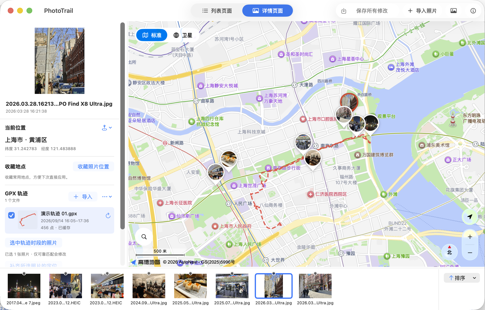

**简体中文** · [English](docs/i18n/README.en.md) · [繁體中文](docs/i18n/README.zh-Hant.md) · [日本語](docs/i18n/README.ja.md) · [한국어](docs/i18n/README.ko.md) · [Español](docs/i18n/README.es.md) · [Português do Brasil](docs/i18n/README.pt-BR.md)

<p align="center">
  
</p>
<h1 align="center">PhotoTrail-相迹</h1>

<p align="center">为照片补上拍摄地点，让中国大陆的地图定位更顺手。</p>

PhotoTrail-相迹 是一款 macOS 照片定位工具。部分照片元数据编辑功能源自 [marchyman/GeoTag](https://github.com/marchyman/GeoTag)；应用还支持高德与苹果地图、GPX 轨迹、逐照片缩略图标记、中国大陆坐标转换、常用地点收藏和七种界面语言。

## 界面预览



*默认使用饱和度更低的地图样式使轨迹和照片更突出，也内置了多种地图风格供切换。*


## 为什么做这个项目

日常生活中有很多通过地图选点，为相机照片和胶片扫描文件补上拍摄位置的需求。但部分工具未正确衔接中国大陆地图坐标体系，容易出现显示偏移，也很难标注正确的位置。

为了减少坐标体系混用造成的偏移，PhotoTrail 在 GeoTag 原版基础上加入高德地图、坐标转换、地点收藏和多语言界面；列表页提供先预览、再应用的保守轨迹匹配流程。

## 语言

支持简体中文、English、繁體中文、日本語、한국어、Español 和 Português do Brasil。首次引导先选择语言：简体中文默认高德地图，其他语言默认 Apple 地图；地图步骤仍可手动选择。已有用户的地图偏好保留。

以后可在设置中修改语言；保存工作并重新打开应用后，所有窗口及系统提示使用新语言。界面语言不改变相机时区或照片时间。地图底图和地点名称的语言由地图服务决定。

源码可能包含尚未发布的改动，下载安装包前请查看对应 Release 是否已包含七语言支持。

## 功能

- **高德地图定位**：在地图上点选拍摄地点，将通过校验的位置转换为 WGS84 后设置到照片。
- **地点搜索**：使用高德官方搜索服务查找地标、建筑和地址；先预览候选地点，再明确应用到照片。
- **常用地点收藏**：为地点添加名称和备注，支持预览、编辑、删除和快速应用。
- **照片列表与详情**：顶部切换页面；列表支持按定位状态筛选、按导入顺序／拍摄时间／文件名排序，详情将照片预览、定位工具与地图组合展示，照片条支持独立筛选、排序和回到当前照片。
- **批量编辑与撤销**：在详情页用 Command 或 Shift 多选照片，双击地图为所选照片设置同一位置，也可从右键菜单复制、粘贴或清除定位；保存前可以撤销或重做。列表中修改但未保存的时间、定位以橙色提示，右键可分别选择从列表移除照片或清除定位。
- **轨迹匹配预览**：只在同一轨迹段内插值，不跨断点或覆盖范围外外推；多轨迹冲突不会静默选择。
- **照片生成轨迹**：按相机时区输出 UTC 时间，长间隔自动分段，先保存在本机缓存并加入轨迹库，需要时可从轨迹菜单导出。
- **照片地图标记**：苹果与高德地图默认显示全部有定位照片的本机缩略图，也可只显示选中照片；支持逐张选择和拖动，选中照片在地图外时显示带缩略图的边缘方向标记。
- **界面与地图配色**：支持亮色、暗色和跟随系统；高德提供 11 种官方配色，亮色默认月光银、暗色默认幻影黑，分别记住手动选择。
- **集中设置**：按地图、照片与保存、轨迹等类别调整偏好；可选择地图启动视野，并在保存前显示待修改文件摘要。
- **JPG + RAW 成对处理**：识别同一张照片的两个版本时只显示 JPG，标注双文件角标，保存定位时同步写入两份文件。
- **定位副本与报告**：只向新目录写入本地照片副本，逐张回读坐标并确认源文件哈希不变，生成本地 JSON 报告。
- **保留原版能力**：拍摄时间及其他元数据编辑、撤销、备份与显式保存。

当前源码支持高德 GPX 轨迹显示：导入后在详情页左栏勾选显示，点击轨迹行查看范围，也可刷新单条轨迹。转换结果只缓存在本机，重启可恢复轨迹清单与缓存；首次显示或刷新时需要等待高德坐标转换。轨迹侧栏可按轨迹时段选中照片，再选择补齐无定位照片或重设所选照片定位。定位修改会显示待保存状态，保存时按完成文件数更新进度。

本地图片通过内置 ExifTool 写入元数据，不重新压缩照片像素。苹果“照片”图库则通过系统 Photos 接口更新。

## Agent Skill

PhotoTrail 提供可独立安装的 [skill 模块](skill/)，无需安装 Mac App，即可让具备本地文件访问和命令执行能力的 agent 完成两项工作：

- **照片生成 GPX**：从有定位和拍摄时间的照片生成轨迹，按时间排序并在长间隔处分段。
- **GPX 给照片补定位**：按拍摄时间匹配轨迹，支持相机时间偏移，输出带定位的 JPEG/HEIC 副本及处理报告，不修改原照片。

### 安装方式

**将[安装说明网址](https://raw.githubusercontent.com/LittleSixNine/PhotoTrail/phototrail/skill/INSTALL.md)发给 agent，让它按照说明完成安装。** 可以直接发送：

> 请阅读 https://raw.githubusercontent.com/LittleSixNine/PhotoTrail/phototrail/skill/INSTALL.md ，按照说明为你当前使用的 agent 安装 PhotoTrail skill，并检查运行环境。

运行需要 **Python 3.11+ 和 ExifTool**，目前已在 macOS 验证。安装位置由 agent 客户端决定；仅支持网页对话、不能访问本地文件或运行程序的 agent 无法完成处理。照片处理在本地完成，不接入地图搜索或苹果 Photos 图库；首版不提供 RAW/XMP 写入。

七语言安装入口见 [Skill 使用指南](docs/i18n/SKILL.zh-Hans.md)，详细参数及使用边界见 [skill 使用说明](skill/SKILL.md)。skill 独立维护，不要求与 Mac App 同步更新。

## Releases · 下载与版本

前往 [Releases 页面](https://github.com/LittleSixNine/PhotoTrail/releases)下载最新版本并查看版本说明。

- 系统要求：需要 **macOS 26 或更新版本**。
- 当前安装包兼容 Apple 芯片与 Intel Mac，采用临时签名，尚未完成开发者签名与 Apple 公证；首次打开可能被 macOS 拦截。

## 基本使用

1. 首次启动依次完成“语言 → 照片备份 → 地图服务 → 确认开始”四步引导；可以返回上一步调整，高德密钥可以稍后填写。打开照片，或把文件拖入窗口。
2. 若使用高德地图，在详情页的地图设置菜单中通过“高德 API 设置”填写自己的 **Web 端 JS API Key** 和 **securityJsCode**；也可选择苹果地图。
3. 选中需要定位的照片，在地图上点选，或搜索地点并点击“应用”。
4. 检查位置后保存。搜索结果的预览不会修改照片；应用位置后仍需手动保存。
5. 常用地点可以保存为收藏，添加名称及备注，下次直接应用。

列表页的轨迹匹配先生成预览，只有明确应用可靠匹配才进入待保存状态；详情页轨迹侧栏则可直接为所选照片应用可靠匹配。照片页还可将所选照片生成 GPX，或选择一个源目录之外的位置导出带定位的副本；这两项都不会覆盖原照片。

## 高德服务与费用

使用高德地图及相关坐标转换功能，需由你自行申请并填写高德开发者密钥。超出账号免费额度或使用付费服务时，可能产生费用，由高德向你的开发者账号计费。相关付费操作在高德开放平台完成，本软件完全免费，不收取或代收任何费用。

高德开发者密钥保存在本机的 macOS 钥匙串中，不以明文写入配置文件，也不会上传至本软件开发者的服务器。调用高德服务时，密钥仅用于向高德进行身份验证。

## 坐标与隐私

高德选点的处理流程为：

```text
高德地图选点／搜索（GCJ-02）
    → 转换为 WGS84
    → 用高德官方正向转换复核
    → 设置照片位置
    → 用户保存
```

- 高德地图显示使用 GCJ-02，确认的新位置和收藏使用 WGS84。当前只接受行政区校验通过的中国大陆选点。
- 原照片未声明坐标系时，只暂按 WGS84 显示，不据此自动改写或补标原始数据。
- 启用高德后，搜索词、地图相关坐标和校验请求会发送给高德；照片文件不会上传给高德。
- 高德轨迹显示默认关闭；主动勾选或点击轨迹行且没有可用缓存时，GPX 坐标分批发送到高德官方转换接口；手动刷新也会重新转换。不会上传 GPX 文件、改写源轨迹或自动给照片定位；按时间匹配仍使用原始 WGS84 数据。
- 高德凭据保存在本机专用钥匙串记录中；收藏保存在应用私有数据目录中，不随代码上传。
- 坐标转换校验用于避免坐标体系混用，不能保证原始 GPS 数据或选点本身准确。

## 开发

构建需要完整 Xcode（支持 Swift 6.2、macOS 26 SDK 或更新版本）、XcodeGen 和 SwiftLint。

```sh
xcodegen generate
xcodebuild -project PhotoTrail.xcodeproj -scheme PhotoTrail \
  -configuration Debug -destination 'platform=macOS' build
```

测试、凭据配置和当前功能边界见 [开发说明](docs/DEVELOPMENT.md)。

源码位于 `Sources/PhotoTrail/`，本地 Swift 包集中在 `Packages/`，应用测试位于 `Tests/`，图标和隐私清单位于 `Resources/`。`docs/` 保存说明与展示图片，`scripts/` 提供构建和测试辅助命令；`skill/` 是可独立安装的照片与 GPX 工具。

## 致谢与许可证

感谢 Marco S Hyman 开发并开源 [GeoTag](https://github.com/marchyman/GeoTag)，也感谢 [ExifTool](https://exiftool.org/) 等上游项目。

PhotoTrail 原创部分的使用与再分发条件见 [使用许可](LICENSE)：允许个人和工作使用及免费再分发，未经书面授权不得收费分发软件或提供付费软件访问。上游与第三方组件保留各自许可，详见 [第三方说明](THIRD_PARTY_NOTICES.md)。PhotoTrail 是独立衍生项目，与 Apple、高德不存在官方关联。
