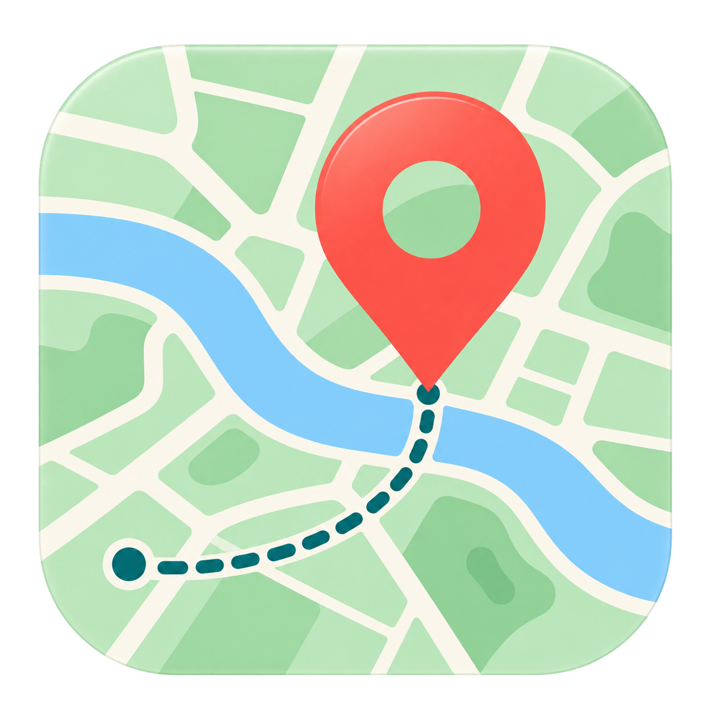

<p align="center">
  
</p>

<h1 align="center">GeoTag CN</h1>

<p align="center">为照片补上拍摄地点，也让中国大陆的地图定位更顺手。</p>

GeoTag CN 是一款 macOS 照片定位工具，基于 [marchyman/GeoTag](https://github.com/marchyman/GeoTag) 开发。在原版的照片元数据编辑能力上，加入高德地图、中国大陆坐标转换、常用地点收藏和简体中文界面。

## 为什么做这个项目

我很喜欢 GeoTag，它能通过地图选点，为相机照片和胶片扫描文件补上拍摄位置。

为了减少国内地图坐标体系混用造成的偏移，我在原版基础上开发了 GeoTag CN，加入高德地图、坐标转换、地点收藏和中文界面，让日常定位更方便。

## 功能

- **高德地图定位**：在地图上点选拍摄地点，将通过校验的位置转换为 WGS84 后设置到照片。
- **地点搜索**：使用高德官方搜索服务查找地标、建筑和地址；先预览候选地点，再明确应用到照片。
- **常用地点收藏**：为地点添加名称和备注，支持预览、编辑、删除和快速应用。
- **简体中文界面**：地图切换、定位信息、搜索和收藏集中在照片右侧，面板可收起。
- **批量编辑与撤销**：给多张选中照片设置同一位置，保存前可以撤销或重做。
- **保留原版能力**：苹果地图、拍摄时间及其他元数据编辑、GPX 相关功能等；高德地图目前只显示主选照片的位置。

本地图片通过内置 ExifTool 写入元数据，不重新压缩照片像素。苹果“照片”图库则通过系统 Photos 接口更新。

## Releases · 下载与版本

安装包、更新说明和已知问题见 [GitHub Releases](https://github.com/LittleSixNine/geotag-cn/releases)。

- 系统要求：由于继承原版 GeoTag 6.0.2，需要 **macOS 26 或更新版本**。
- 当前构建方式：本机临时签名；尚未完成用于公开分发的开发者签名与 Apple 公证。

## 基本使用

1. 打开照片，或把文件拖入窗口；首次验证建议使用照片副本。
2. 在照片右侧切换到“高德”，通过“高德设置”填写自己的 **Web 端 JS API Key** 和 **securityJsCode**。
3. 选中需要定位的照片，在地图上点选，或搜索地点并点击“应用”。
4. 检查位置后保存。搜索结果的预览不会修改照片；应用位置后仍需手动保存。
5. 常用地点可以保存为收藏，添加名称及备注，下次直接应用。

## 坐标与隐私

高德选点的处理流程为：

```text
高德地图选点／搜索（GCJ-02）
    → 转换为 WGS84
    → 用高德官方正向转换复核
    → 设置照片位置
    → 用户保存
```

- 高德地图显示使用 GCJ-02，确认的新位置和收藏使用 WGS84。当前只接受行政区校验通过的中国大陆选点。
- 原照片未声明坐标系时，只暂按 WGS84 显示，不据此自动改写或补标原始数据。
- 启用高德后，搜索词、地图相关坐标和校验请求会发送给高德；照片文件不会上传给高德。
- 高德凭据保存在本机专用钥匙串记录中；收藏保存在应用私有数据目录中，不随代码上传。
- 坐标转换校验用于避免坐标体系混用，不能保证原始 GPS 数据或选点本身准确。

## 开发

项目基于原版 **GeoTag v6.0.2**。构建需要完整 Xcode（支持 Swift 6.2、macOS 26 SDK 或更新版本）、XcodeGen 和 SwiftLint。

```sh
xcodegen generate
xcodebuild -project GeoTag.xcodeproj -scheme GeoTag \
  -configuration Debug -destination 'platform=macOS' build
```

测试、凭据配置和当前功能边界见 [开发说明](DEVELOPMENT.md)。

## 致谢与许可证

感谢 Marco S Hyman 开发并开源 [GeoTag](https://github.com/marchyman/GeoTag)，也感谢 [ExifTool](https://exiftool.org/) 等上游项目。

本项目沿用原版的 [MIT 许可证](LICENSE)，保留原作者版权信息。坐标转换相关来源及许可见 [第三方说明](THIRD_PARTY_NOTICES.md)。GeoTag CN 是独立衍生项目，与 Apple、高德不存在官方关联。
