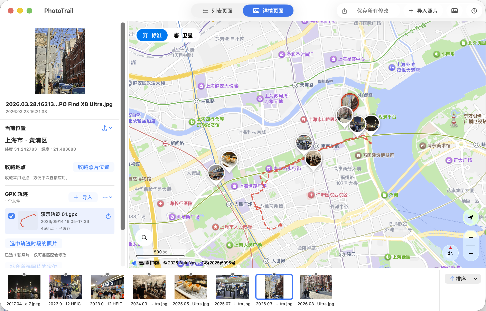

**简体中文** · [English](docs/i18n/README.en.md) · [繁體中文](docs/i18n/README.zh-Hant.md) · [日本語](docs/i18n/README.ja.md) · [한국어](docs/i18n/README.ko.md) · [Español](docs/i18n/README.es.md) · [Português do Brasil](docs/i18n/README.pt-BR.md)

<p align="center">
  
</p>
<h1 align="center">PhotoTrail-相迹</h1>

<p align="center">从轨迹匹配、元数据编辑到批量重命名，整理照片的拍摄地点、信息与文件名。</p>

PhotoTrail-相迹 是一款 macOS 照片信息整理工具。拍摄结束后，可以按轨迹补齐定位，统一照片的时间、作者与设备信息，再按规则整理文件名。三项工作共用导入的照片，也可以分别使用。

| 想完成的整理 | 使用功能 | 常见用途 |
| --- | --- | --- |
| 补上或校正拍摄地点 | 轨迹匹配与地图定位 | 按旅行轨迹补定位，在地图上检查或调整位置 |
| 检查并补全照片信息 | 元数据查看与编辑 | 校正时间，填写作者、版权、关键词和设备信息 |
| 统一文件命名 | 批量重命名 | 按拍摄日期和编号命名，替换文字，保留照片与附属文件配对 |

## 下载与安装

[下载最新正式版](https://github.com/LittleSixNine/PhotoTrail/releases/latest) · [查看版本记录](https://github.com/LittleSixNine/PhotoTrail/releases)

需要 **macOS 26 或更新版本**，安装包同时支持 Apple 芯片与 Intel Mac。打开 DMG，退出正在使用的 PhotoTrail，再将应用拖入“应用程序”文件夹。

PhotoTrail 免费使用。当前安装包采用临时签名，尚未完成 Developer ID 签名与 Apple 公证，首次打开可能被 macOS 拦截。自动下载更新默认关闭，安装需手动完成。

## 三类照片整理任务

### 1. 轨迹匹配与地图定位

为没有 GPS 的相机照片补上拍摄地点，也可以在地图上复核、调整已有位置。

- **按时间匹配轨迹**：导入 GPX、KML、KMZ，按照片拍摄时间匹配带逐点时间的轨迹。照片列表可先预览再应用；地图左栏可补齐缺失定位，或明确选择重设已有定位。匹配只在同一轨迹段及记录覆盖范围内进行，不跨断点外推，也不静默处理多轨迹冲突。
- **在地图上调整**：支持苹果地图与高德地图、地点搜索、收藏和照片缩略图标记。可多选照片统一设置位置，也可拖动单张照片标记；高德确认的位置经校验后转换为 WGS84 写入。
- **从照片生成轨迹**：将已有定位和拍摄时间的照片生成 GPX，长间隔自动分段；轨迹可本地缓存、显示、隐藏及导出。也可向新目录导出带定位的照片副本与核对报告。

没有逐点时间的路线仅供查看，不能用于时间匹配。轨迹 CSV 暂不支持；照片轨迹导出为 GPX。KMZ 只读取根目录 doc.kml 或包内唯一的 KML，不加载外部链接和附件。

### 2. 元数据查看与编辑

从常用信息的快速补录，到按来源查看完整标签、批量处理日期和设备信息。

- **常用字段快速改**：照片信息、拍摄时间、设备分组显示，可直接填写标题、说明、作者、版权、关键词和主要日期；品牌、型号可搜索选择商品名称或元数据型号，并保留自定义输入。[设备目录与来源](docs/DEVICE_CATALOG.md)。
- **完整字段清楚看**：紧凑的左右列表显示字段名称、数值与来源，支持搜索、分组、筛选和附加标签。完整元数据在后台读取，优先处理选中照片；EXIF、IPTC、XMP 及厂商私有信息按实际来源显示。
- **多照片、多字段一起处理**：用 ⌘／Shift 选择照片或字段，按类型编辑、统一赋值或复制其他字段的值。例如，将每张照片各自的 EXIF 创建时间复制给多个日期字段；复杂操作先预览，再加入可撤销草稿。
- **整理与交换信息**：支持日期偏移、相机／镜头和曝光信息补录、元数据预设、逐照片比较，以及受控的元数据 CSV／XMP 导入导出。

**查看范围与编辑范围不同。** 当前新编辑器开放 62 个 EXIF／IPTC／XMP 字段，支持 JPEG 图内字段及已有 XMP 附属文件；只读标签有锁标识。RAW 原图、HEIC 和苹果“照片”图库不开放这些新增字段的编辑，原有日期／定位功能保留。元数据 CSV 交换与暂未支持的轨迹 CSV 是两项不同功能。详细范围见[功能与数据约定](docs/BEHAVIOR.md)。

### 3. 批量重命名

把相机默认文件名整理为便于查找、排序和交付的名称。

- **从常用方案开始**：拍摄日期＋编号、原名加前缀、查找替换，也可组合文字、日期、序列、元数据标签、列表和正则等规则；提供 97 个动作入口及筛选、进阶设置。
- **对照原名与新名**：左侧编排规则，右侧预览原名、最终名称、配对文件与冲突；需要时查看某一步的中间结果。可保存预设重复使用。
- **保留配对并检查冲突**：照片与同名附属文件成组预览，改名时不覆盖已有文件。执行记录支持核对和恢复原名，前提是文件身份与内容仍符合记录。

可使用已导入的本地照片，或通过“添加文件”加入普通文件；文件夹和照片图库项目不参与。存在未保存的照片信息或定位修改时，应用先提醒保存，保存后需重新核对预览并确认改名。重命名单独执行，不包含在元数据保存中。

## 修改如何保存

照片信息与定位共用右上角的 **“写入所有元数据”**（⌘S），写入当前窗口中所有照片的待保存修改，**不限当前页面、当前选择或筛选结果**。浏览、预览和切换页面不会自动写文件；保存前可撤销，本地文件保存遵循备份设置，并回读核对写入结果。

本地照片通过内置 ExifTool 写入元数据，不重新压缩照片像素；苹果“照片”图库通过系统 Photos 接口更新，功能范围与本地文件不同。JPG＋RAW 配对可同步保存定位，新增元数据字段不会自动复制到 RAW。本地文件备份不涵盖照片图库项目。

## 从一批照片开始

1. **导入与检查**：完成语言、备份和地图引导，打开或拖入照片。先核对拍摄时间与相机时区；需要时到元数据页校正。
2. **补齐位置**：导入 GPX／KML／KMZ，选择照片并检查匹配结果，应用可靠匹配；没有轨迹时，可使用地图选点、搜索或收藏。
3. **补全信息**：在“元数据编辑”的常用字段中快速填写；需要更多项目时切到完整字段，搜索标签或使用批量工具。
4. **统一保存**：核对待保存修改，点击“写入所有元数据”。使用高德时需自行配置 Web 端 JS API Key 和 securityJsCode；苹果地图不需要高德密钥。
5. **整理文件名**：进入“重命名”，选择范围和规则，核对配对、冲突及新名称后执行。无需改名时可跳过。

可以只使用其中一项功能。生成 GPX 或导出定位副本不会覆盖原照片；从列表移除照片也不会删除文件。

## 大量照片与缓存

大量照片导入并完成读取后，元数据列表和定位照片条可按需加载缩略图，当前照片的大预览优先加载。照片切换和照片条滚动减少重复计算。更新沿用已有设置、收藏与轨迹缓存；缩略图和元数据读取缓存仅在本次运行保留，退出后重新加载。

## 界面预览



## 语言

支持简体中文、English、繁體中文、日本語、한국어、Español 和 Português do Brasil。首次引导先选择语言：简体中文默认高德地图，其他语言默认 Apple 地图；地图步骤仍可手动选择。已有用户的地图偏好保留。

以后可在设置中修改语言；保存工作并重新打开应用后，所有窗口及系统提示使用新语言。界面语言不改变相机时区或照片时间。地图底图和地点名称的语言由地图服务决定。

## 高德服务与费用

使用高德地图及相关坐标转换功能，需由你自行申请并填写高德开发者密钥。超出账号免费额度或使用付费服务时，可能产生费用，由高德向你的开发者账号计费。相关付费操作在高德开放平台完成，本软件完全免费，不收取或代收任何费用。

高德开发者密钥保存在本机的 macOS 钥匙串中，不以明文写入配置文件，也不会上传至本软件开发者的服务器。调用高德服务时，密钥仅用于向高德进行身份验证。

## 坐标与隐私

高德选点的处理流程为：

```text
高德地图选点／搜索（GCJ-02）
    → 转换为 WGS84
    → 用高德官方正向转换复核
    → 设置照片位置
    → 用户保存
```

- 高德地图显示使用 GCJ-02，确认的新位置和收藏使用 WGS84。当前只接受行政区校验通过的中国大陆选点。
- 原照片未声明坐标系时，只暂按 WGS84 显示，不据此自动改写或补标原始数据。
- 启用高德后，搜索词、地图相关坐标和校验请求会发送给高德；照片文件不会上传给高德。
- 高德轨迹显示默认关闭；主动勾选或点击轨迹行且没有可用缓存时，轨迹坐标分批发送到高德官方转换接口；手动刷新也会重新转换。不会上传轨迹文件、改写源轨迹或自动给照片定位；按时间匹配仍使用原始 WGS84 数据。
- 高德凭据保存在本机专用钥匙串记录中；收藏保存在应用私有数据目录中，不随代码上传。
- 坐标转换校验用于避免坐标体系混用，不能保证原始 GPS 数据或选点本身准确。

## 项目来源

PhotoTrail 起初用于为相机照片和胶片扫描文件补上拍摄位置，并处理中国大陆地图坐标转换；目前已扩展到元数据编辑与文件命名。部分照片处理能力源自 [marchyman/GeoTag](https://github.com/marchyman/GeoTag)。

## Agent Skill

PhotoTrail 提供可独立安装的 [skill 模块](skill/)，无需安装 Mac App，即可让具备本地文件访问和命令执行能力的 agent 完成两项工作：

- **照片生成 GPX**：从有定位和拍摄时间的照片生成轨迹，按时间排序并在长间隔处分段。
- **GPX 给照片补定位**：按拍摄时间匹配轨迹，支持相机时间偏移，输出带定位的 JPEG/HEIC 副本及处理报告，不修改原照片。

### 安装方式

**将[安装说明网址](https://raw.githubusercontent.com/LittleSixNine/PhotoTrail/phototrail/skill/INSTALL.md)发给 agent，让它按照说明完成安装。** 可以直接发送：

> 请阅读 https://raw.githubusercontent.com/LittleSixNine/PhotoTrail/phototrail/skill/INSTALL.md ，按照说明为你当前使用的 agent 安装 PhotoTrail skill，并检查运行环境。

运行需要 **Python 3.11+ 和 ExifTool**，目前已在 macOS 验证。安装位置由 agent 客户端决定；仅支持网页对话、不能访问本地文件或运行程序的 agent 无法完成处理。照片处理在本地完成，不接入地图搜索或苹果 Photos 图库；首版不提供 RAW/XMP 写入。

七语言安装入口见 [Skill 使用指南](docs/i18n/SKILL.zh-Hans.md)，详细参数及使用边界见 [skill 使用说明](skill/SKILL.md)。skill 独立维护，不要求与 Mac App 同步更新。

## 开发

构建需要完整 Xcode（支持 Swift 6.2、macOS 26 SDK 或更新版本）、XcodeGen 和 SwiftLint。

```sh
xcodegen generate
xcodebuild -project PhotoTrail.xcodeproj -scheme PhotoTrail \
  -configuration Debug -destination 'platform=macOS' build
```

测试、凭据配置和当前功能边界见 [开发说明](docs/DEVELOPMENT.md)。

源码位于 `Sources/PhotoTrail/`，本地 Swift 包集中在 `Packages/`，应用测试位于 `Tests/`，图标和隐私清单位于 `Resources/`。`docs/` 保存说明与展示图片，`scripts/` 提供构建和测试辅助命令；`skill/` 是可独立安装的照片与 GPX 工具。

## 致谢与许可证

感谢 Marco S Hyman 开发并开源 [GeoTag](https://github.com/marchyman/GeoTag)，也感谢 [ExifTool](https://exiftool.org/) 等上游项目。

PhotoTrail 原创部分的使用与再分发条件见 [使用许可](LICENSE)：允许个人和工作使用及免费再分发，未经书面授权不得收费分发软件或提供付费软件访问。上游与第三方组件保留各自许可，详见 [第三方说明](THIRD_PARTY_NOTICES.md)。PhotoTrail 是独立衍生项目，与 Apple、高德不存在官方关联。
