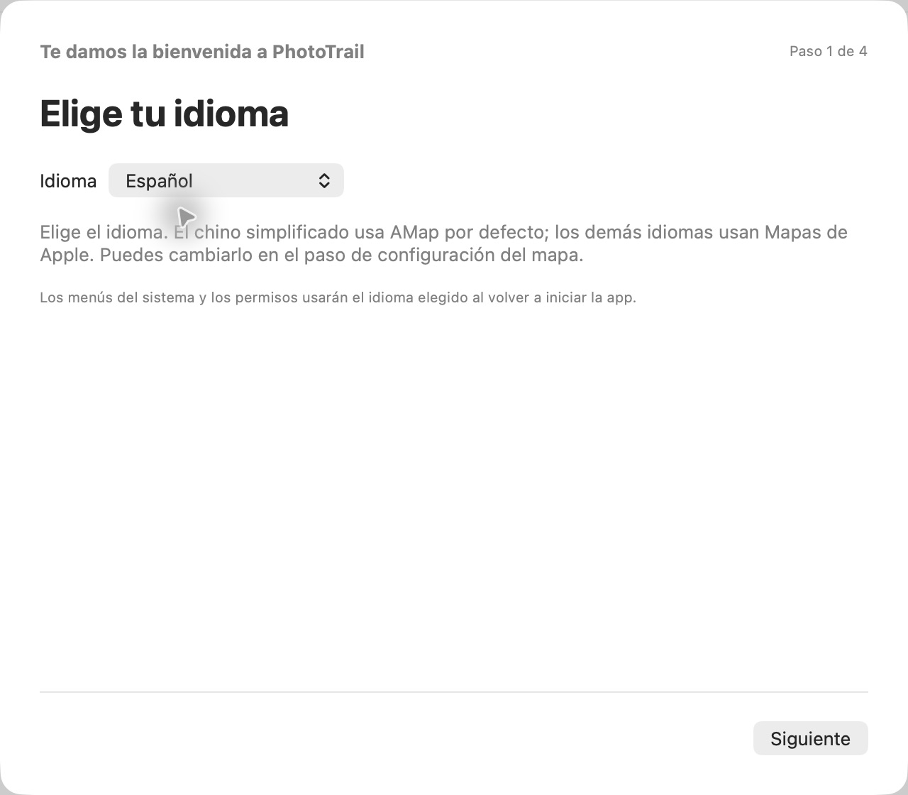

[简体中文](../../README.md) · [English](../../docs/i18n/README.en.md) · [繁體中文](../../docs/i18n/README.zh-Hant.md) · [日本語](../../docs/i18n/README.ja.md) · [한국어](../../docs/i18n/README.ko.md) · **Español** · [Português do Brasil](../../docs/i18n/README.pt-BR.md)

# PhotoTrail

Añade y edita ubicaciones de fotos en macOS.

PhotoTrail es una app de macOS basada en parte en [GeoTag](https://github.com/marchyman/GeoTag). Combina Mapas de Apple, AMap, rutas GPX, marcadores con miniaturas, lugares favoritos y control explícito del guardado de metadatos.

## Idiomas y configuración

Disponible en chino simplificado, inglés, chino tradicional, japonés, coreano, español y portugués de Brasil. Elige el idioma en el primer paso de configuración. **El chino simplificado usa AMap por defecto; los demás idiomas usan Mapas de Apple.** Puedes cambiarlo en el paso del mapa. Se conserva el mapa elegido por los usuarios existentes.

Puedes cambiar el idioma en Ajustes. Guarda tu trabajo y vuelve a abrir la app para aplicarlo a todas las ventanas y avisos del sistema. El idioma no cambia la zona horaria de la cámara ni las fechas de las fotos.

## Funciones

- **Ubicar fotos en el mapa:** elige un punto en Mapas de Apple o AMap. Las coordenadas de AMap se verifican y convierten a WGS84 antes de aplicarlas.
- **Búsqueda y favoritos:** previsualiza resultados antes de aplicarlos. Guarda lugares con nombres y notas; edítalos, elimínalos o reutilízalos.
- **Lista y espacio de mapa:** filtra por ubicación o cambios pendientes y ordena por importación, fecha de captura o nombre. La tira de fotos tiene filtros y orden propios y un botón para volver a la foto actual.
- **Edición por lotes y deshacer:** selecciona con Comando o Mayús para aplicar, copiar, pegar o borrar ubicaciones. Puedes deshacer y rehacer antes de guardar. Quitar fotos de la lista no borra sus archivos.
- **Coincidencias GPX prudentes:** previsualiza resultados en la lista y aplica las coincidencias fiables. Solo se interpola dentro de un segmento y su cobertura temporal; las rutas en conflicto no se resuelven sin avisar. La barra de rutas permite completar ubicaciones vacías o sustituir las de la selección.
- **GPX desde fotos:** crea rutas con ubicaciones y fechas de captura. La zona horaria de la cámara determina la salida UTC; los intervalos largos crean segmentos separados. Las rutas se guardan localmente y se pueden exportar.
- **Historial de rutas:** muestra u oculta rutas, consulta su extensión, actualízalas y reutiliza la caché local de conversiones. Las coincidencias siempre usan el WGS84 original.
- **Marcadores de fotos:** ambos mapas muestran miniaturas locales. Puedes mostrar todas las fotos o la selección, elegir y arrastrar marcadores y localizar fotos seleccionadas fuera de la vista.
- **Apariencia y ajustes:** modo claro, oscuro o del sistema; once estilos de AMap; vista inicial; copias de seguridad y resumen opcional antes de guardar.
- **Pares JPG + RAW:** se muestran juntos y ambos reciben los cambios de ubicación al guardar.
- **Copias con ubicación:** exporta fuera de la carpeta original, verifica las coordenadas escritas y comprueba que los hashes originales no cambien. Genera un informe JSON local.
- **Metadatos:** edita la fecha de captura y otros campos compatibles con guardado explícito. Los archivos locales usan ExifTool incluido, sin recomprimir los píxeles. La fototeca usa la interfaz Photos del sistema.

## Descarga y requisitos

Consulta los paquetes publicados y sus notas en [GitHub Releases](https://github.com/LittleSixNine/PhotoTrail/releases). El repositorio puede contener cambios aún no publicados; comprueba la disponibilidad de idiomas en las notas de cada versión.

Requiere **macOS 26 o posterior**. Compatible con Apple silicon e Intel. La distribución actual usa firma ad-hoc y aún no tiene firma Developer ID ni notarización de Apple, por lo que macOS puede bloquear el primer inicio.

PhotoTrail es gratuito. La descarga automática de actualizaciones está desactivada por defecto. La instalación es manual: abre el DMG, sal de PhotoTrail y arrastra la app a Aplicaciones.

## Primeros pasos

1. Configura idioma, copias de fotos, mapa y confirmación. El idioma de la guía cambia al instante; algunos avisos del sistema requieren reabrir la app.
2. Abre fotos locales, arrastra archivos o carpetas a la ventana o selecciona fotos de la fototeca. Se omiten archivos que no son imágenes; los GPX se importan como rutas.
3. Para AMap, introduce tu **Key de la API JS para web** y **securityJsCode**. Puedes hacerlo después o usar Mapas de Apple sin claves de AMap.
4. Selecciona fotos y aplica un punto del mapa, un resultado de búsqueda o un favorito. Esto crea cambios pendientes; no escribe inmediatamente en el archivo.
5. Revisa y guarda. Puedes deshacer antes de guardar. Al cerrar con cambios pendientes, se pide continuar editando o descartarlos.

Para cruzar GPX, comprueba primero la zona horaria de la cámara, importa la ruta, selecciona fotos y previsualiza los resultados. El historial de coincidencias solo dura la sesión actual. Importar o mostrar una ruta no modifica las ubicaciones de las fotos.

Crear GPX o exportar copias no sobrescribe las fotos originales. Las copias de archivos locales no cubren elementos de la fototeca. Actualizar la fototeca y exportar archivos son operaciones distintas.

## Mapas y privacidad

AMap convierte las ubicaciones seleccionadas a WGS84 antes de aplicarlas. Los cambios solo se escriben en las fotos al guardar. También puedes editar correctamente la ubicación de fotos tomadas en China continental.

- Las coordenadas existentes sin datum declarado se muestran provisionalmente como WGS84; esto no modifica sus metadatos.
- AMap recibe términos de búsqueda y coordenadas necesarias para mostrar el mapa y validar ubicaciones. No se suben archivos de fotos.
- Mostrar una ruta sin caché local válida envía sus coordenadas a AMap por lotes para convertirlas. El archivo GPX no se sube ni modifica, y las coincidencias siguen usando los datos WGS84 originales.
- Las claves de AMap se guardan en el llavero local de macOS; los favoritos y las cachés, en la carpeta local de la app.
- Las etiquetas, los resultados de búsqueda y los nombres de lugares dependen del proveedor. Siete idiomas de interfaz no garantizan mapas en siete idiomas.
- La validación ayuda a evitar errores al mezclar sistemas de coordenadas, pero no confirma la precisión del GPS original ni de un punto elegido manualmente.

Obtén tus propias credenciales de AMap. Superar la cuota gratuita o usar servicios de pago puede generar cargos en tu cuenta. PhotoTrail no recauda esas tarifas; gestiona los pagos en AMap.

## Skill para agentes y desarrollo

La [guía del Skill independiente](SKILL.es.md) explica cómo crear GPX desde fotos o generar copias JPEG/HEIC con ubicación e informes a partir de fotos y GPX. Requiere **Python 3.11+ y ExifTool** y se ha verificado en macOS. El agente debe poder acceder a archivos locales y ejecutar comandos; un chat solo con navegador no basta.

El Skill procesa localmente y no accede a mapas, credenciales de la app ni fototeca. Su escritura actual no admite RAW/XMP. Los comandos, claves JSON, estados y códigos de error no cambian con el idioma.

Consulta la [guía de desarrollo en inglés](DEVELOPMENT.en.md). Gracias a Marco S Hyman por GeoTag y al proyecto ExifTool. Consulta la [licencia original](../../LICENSE), su [traducción de referencia al inglés](LICENSE.en.md) y los [avisos de terceros](../../THIRD_PARTY_NOTICES.md). Se permite el uso personal y profesional y la redistribución gratuita; cobrar por distribuir el software o acceder a él requiere permiso conforme a la licencia aplicable. PhotoTrail es independiente y no está afiliado oficialmente a Apple ni a AMap.
