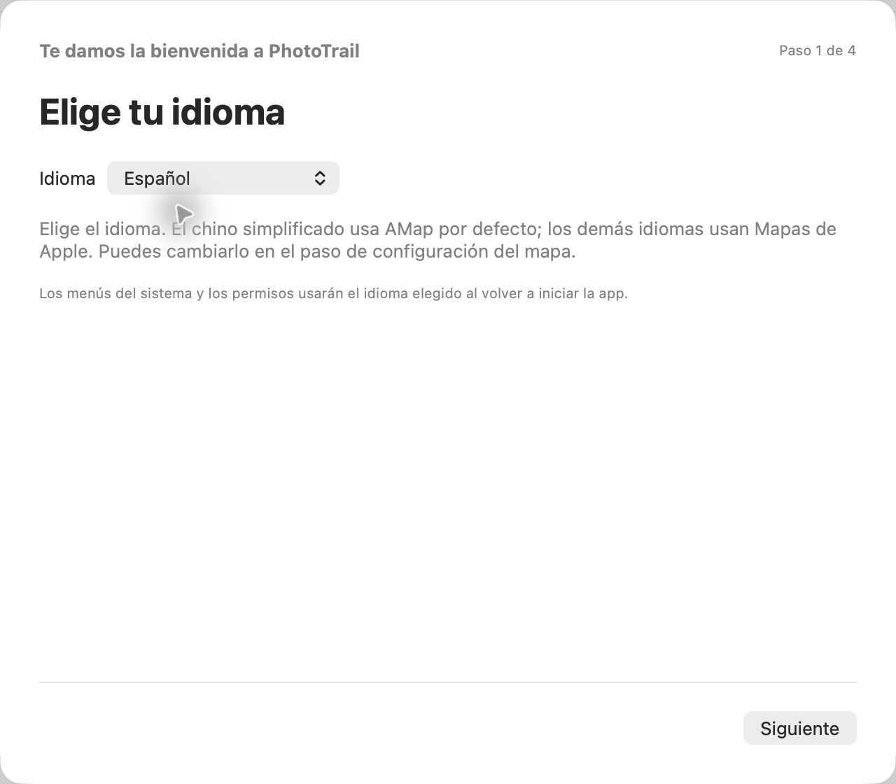

[简体中文](../../README.md) · [English](../../docs/i18n/README.en.md) · [繁體中文](../../docs/i18n/README.zh-Hant.md) · [日本語](../../docs/i18n/README.ja.md) · [한국어](../../docs/i18n/README.ko.md) · **Español** · [Português do Brasil](../../docs/i18n/README.pt-BR.md)

# PhotoTrail

Organiza ubicaciones, metadatos y nombres de fotos en macOS.

PhotoTrail reúne **la asociación de fotos con recorridos, la edición de metadatos y el renombrado por lotes**. Añade ubicaciones de un viaje, corrige fechas y datos y aplica un criterio común a los nombres. Puedes combinar estos flujos o usarlos por separado. Parte del procesamiento de fotos procede de [GeoTag](https://github.com/marchyman/GeoTag).

| Qué quieres organizar | Función | Ejemplos |
| --- | --- | --- |
| Lugares de captura | Recorridos y mapas | Asociar un recorrido y revisar ubicaciones en el mapa |
| Información de las fotos | Consulta y edición de metadatos | Fechas, autoría, palabras clave y datos del equipo |
| Nombres de archivos | Renombrado por lotes | Fecha y secuencia, sustitución de texto y archivos asociados |

## Descarga y requisitos

[Descargar la última versión estable](https://github.com/LittleSixNine/PhotoTrail/releases/latest) · [Historial de versiones](https://github.com/LittleSixNine/PhotoTrail/releases)

Requiere **macOS 26 o posterior**. Compatible con Apple silicon e Intel. La distribución actual usa firma ad-hoc y aún no tiene firma Developer ID ni notarización de Apple, por lo que macOS puede bloquear el primer inicio.

PhotoTrail es gratuito. La descarga automática de actualizaciones está desactivada por defecto. La instalación es manual: abre el DMG, sal de PhotoTrail y arrastra la app a Aplicaciones.

## Funciones

### 1. Recorridos y ubicación en mapas

- **Asocia fotos por hora:** importa GPX, KML o KMZ con marcas de tiempo por punto. Previsualiza los resultados en la lista o usa la barra del mapa para completar ubicaciones ausentes o sustituirlas explícitamente. Las coincidencias se limitan al mismo segmento y su cobertura; no se extrapola a través de interrupciones ni se resuelven conflictos sin avisar.
- **Revisa y ajusta en el mapa:** usa Mapas de Apple o AMap, búsquedas, favoritos y miniaturas. Aplica una ubicación a varias fotos o arrastra un marcador individual. Las ubicaciones confirmadas de AMap se verifican y convierten a WGS84.
- **Crea y exporta recorridos:** genera GPX a partir de fotos con ubicación y fecha; los intervalos largos crean segmentos. Muestra, oculta, almacena y exporta recorridos, o exporta copias de fotos con ubicación y un informe de verificación a una carpeta nueva.

Los recorridos sin hora por punto son solo de consulta. No se admite CSV de recorridos; los generados con fotos se exportan como GPX. KMZ lee doc.kml en la raíz o el único KML del archivo, sin cargar enlaces externos ni adjuntos.

Al guardar una ubicación también se pueden escribir provincia/estado, ciudad, distrito y el país/código que devuelve el servicio. Puedes desactivar el complemento automático o completar campos regionales ausentes en fotos locales/XMP con GPS desde el mapa. Fotos de Apple sigue admitiendo solo cambios de ubicación y fecha mediante la interfaz del sistema.

### 2. Consulta y edición de metadatos

Los campos comunes y completos comparten lista y controles de edición. Las fechas identifican su origen EXIF, IPTC, XMP o del sistema de archivos.

- **Consulta y edita campos:** busca nombres, etiquetas o valores y recorre grupos. Usa editores adecuados para texto, fechas y dispositivos. [Catálogo](../DEVICE_CATALOG.md).
- **Preajustes por lotes:** organiza asignaciones, copias y ajustes de fechas; comprueba la vista previa antes de añadir cambios pendientes. Crea, guarda, carga, elimina e intercambia preajustes JSON; copia un campo a varios destinos.
- **Copia y pega campos:** ⌘C/⌘V o Ctrl+C/Ctrl+V pegan el valor original en varios campos editables. Los valores modificados aparecen en naranja; hay que guardar para escribir los archivos.
- **Fechas e intercambio:** aumenta o reduce años, meses, días, horas, minutos y segundos por separado. Cambia una parte de la fecha, usa intervalos fijos o distribuye fechas uniformemente; conserva el intercambio controlado CSV/XMP y la comparación por foto.

**No todo campo legible es editable.** Los campos admitidos en JPEG y XMP existentes dependen del origen y formato. También se editan fechas de creación y modificación de JPEG locales. Las etiquetas estructurales, calculadas o no verificadas siguen bloqueadas. RAW originales, HEIC y Fotos de Apple no usan estos nuevos editores; se conservan las herramientas anteriores de fecha y ubicación. [Destinos y límites](../BEHAVIOR.md) (chino).

### 3. Renombrado por lotes

- **Ordena las reglas:** arrastra el asa de tres líneas para mover la tarjeta y usa el botón derecho en su espacio vacío para duplicar o eliminar. Texto, fechas y secuencias comparten términos como Reemplazar o Añadir al principio.
- **Gestiona esquemas:** los cinco esquemas predeterminados y los personales se pueden editar, eliminar, guardar e intercambiar mediante JSON en una sola lista. Dispositivo y ciudad tienen tarjetas propias. Al editar reglas, el ejemplo se actualiza con el primer resultado de la vista previa y se guarda con el esquema. Las tarjetas guardadas se abren contraídas; las reglas sin guardar no sobrescriben el esquema.
- **Revisa nombres y conflictos:** la tabla muestra nombres originales y finales, archivos relacionados y conflictos, con una columna intermedia opcional. Los sufijos numéricos admiten 2–5 dígitos y separadores. La ejecución muestra progreso central y Detener y restaurar.

Las tres pestañas comparten fotos y selección, también las importadas desde Renombrar. El alcance predeterminado son todas las fotos, con opción de usar las seleccionadas. Se mantienen las asociaciones JPG/RAW/XMP. Quitar una foto sincroniza las pestañas, puede deshacerse y no borra el archivo. Las fotos sin ruta local no se renombrarán directamente. Guarda primero los cambios de información o ubicación, revisa la vista previa y confirma. El historial restaura nombres solo si identidad y contenido coinciden.

### Guardar los cambios

Por defecto, **Guardar todos los metadatos** (⌘S) guarda los cambios pendientes de ambas pestañas, sin limitarse a la selección o filtros. El aviso permite confirmar, cancelar, cambiar a la pestaña actual o no volver a mostrarlo. En los ajustes de fotos y guardado puedes guardar solo la pestaña actual y conservar los cambios de la otra. Consultar y previsualizar no escribe archivos. Las escrituras locales respetan las copias de seguridad y verifican los resultados mediante una nueva lectura, sin recomprimir píxeles. JPG + RAW pueden compartir la ubicación; los campos nuevos no se copian automáticamente a RAW. Fotos usa la interfaz del sistema con un alcance distinto.

## Muchas fotos y caché

La importación estima el tiempo restante de todo el proceso; si faltan datos de velocidad, indica que se está calculando. Los lotes de más de 300 fotos muestran un aviso de espera. La renombración muestra progreso global y permite detener y restaurar los nombres.

Tras importar las fotos y preparar sus metadatos, las miniaturas se cargan bajo demanda en la lista de metadatos y en la tira de fotos de ubicación, dando prioridad a la vista previa de la foto actual. Cambiar de foto y desplazarse por la tira evita cálculos repetidos. Las actualizaciones conservan los ajustes, favoritos y cachés de rutas; las cachés de miniaturas y lectura de metadatos solo duran durante la sesión y se reconstruyen al volver a abrir la app.

## Primeros pasos

1. **Importa y comprueba:** configura idioma, copias y mapa; abre o arrastra fotos. Revisa fechas y zona horaria de la cámara y corrígelas en el espacio de metadatos si es necesario.
2. **Añade ubicaciones:** importa GPX/KML/KMZ, selecciona fotos, revisa coincidencias y aplica los resultados fiables. Sin recorrido, usa el mapa, la búsqueda o los favoritos.
3. **Completa la información:** usa los campos habituales para editar rápido y la lista completa para otras etiquetas y herramientas por lotes.
4. **Guarda todo junto:** revisa los cambios y pulsa Guardar todos los metadatos. AMap requiere tu Web JS API Key y securityJsCode; Mapas de Apple no necesita credenciales de AMap.
5. **Ordena los nombres:** elige el alcance y las reglas, comprueba archivos asociados, conflictos y nombres finales, y confirma. Omite este paso si quieres conservar los nombres.

Puedes usar cada función por separado. Generar GPX o exportar copias con ubicación no sobrescribe los originales; quitar fotos de la lista no borra sus archivos. Las copias de seguridad de archivos locales no incluyen elementos de la fototeca.

## Idiomas y configuración

Disponible en chino simplificado, inglés, chino tradicional, japonés, coreano, español y portugués de Brasil. Elige el idioma en el primer paso de configuración. **El chino simplificado usa AMap por defecto; los demás idiomas usan Mapas de Apple.** Puedes cambiarlo en el paso del mapa. Se conserva el mapa elegido por los usuarios existentes.

Puedes cambiar el idioma en Ajustes. Guarda tu trabajo y vuelve a abrir la app para aplicarlo a todas las ventanas y avisos del sistema. El idioma no cambia la zona horaria de la cámara ni las fechas de las fotos.

## Mapas y privacidad

AMap convierte las ubicaciones seleccionadas a WGS84 antes de aplicarlas. Los cambios solo se escriben en las fotos al guardar. También puedes editar correctamente la ubicación de fotos tomadas en China continental.

- Las coordenadas existentes sin datum declarado se muestran provisionalmente como WGS84; esto no modifica sus metadatos.
- AMap recibe términos de búsqueda y coordenadas necesarias para mostrar el mapa y validar ubicaciones. No se suben archivos de fotos.
- Mostrar una ruta sin caché local válida envía sus coordenadas a AMap por lotes para convertirlas. El archivo del recorrido no se sube ni modifica, y las coincidencias siguen usando los datos WGS84 originales.
- Las claves de AMap se guardan en el llavero local de macOS; los favoritos y las cachés, en la carpeta local de la app.
- Las etiquetas, los resultados de búsqueda y los nombres de lugares dependen del proveedor. Siete idiomas de interfaz no garantizan mapas en siete idiomas.
- La validación ayuda a evitar errores al mezclar sistemas de coordenadas, pero no confirma la precisión del GPS original ni de un punto elegido manualmente.

Obtén tus propias credenciales de AMap. Superar la cuota gratuita o usar servicios de pago puede generar cargos en tu cuenta. PhotoTrail no recauda esas tarifas; gestiona los pagos en AMap.

## Skill para agentes y desarrollo

La [guía del Skill independiente](SKILL.es.md) explica cómo crear GPX desde fotos o generar copias JPEG/HEIC con ubicación e informes a partir de fotos y GPX. Requiere **Python 3.11+ y ExifTool** y se ha verificado en macOS. El agente debe poder acceder a archivos locales y ejecutar comandos; un chat solo con navegador no basta.

El Skill procesa localmente y no accede a mapas, credenciales de la app ni fototeca. Su escritura actual no admite RAW/XMP. Los comandos, claves JSON, estados y códigos de error no cambian con el idioma.

Consulta la [guía de desarrollo en inglés](DEVELOPMENT.en.md). Gracias a Marco S Hyman por GeoTag y al proyecto ExifTool. Consulta la [licencia original](../../LICENSE), su [traducción de referencia al inglés](LICENSE.en.md) y los [avisos de terceros](../../THIRD_PARTY_NOTICES.md). Se permite el uso personal y profesional y la redistribución gratuita; cobrar por distribuir el software o acceder a él requiere permiso conforme a la licencia aplicable. PhotoTrail es independiente y no está afiliado oficialmente a Apple ni a AMap.
