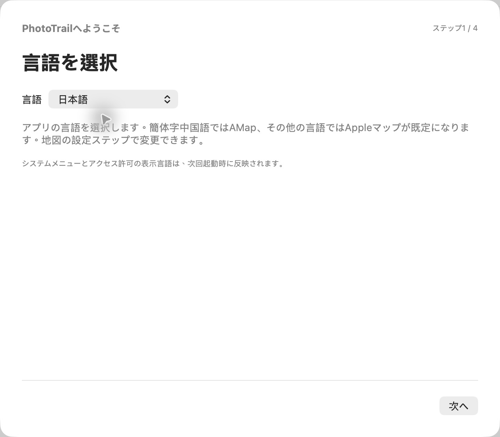

[简体中文](../../README.md) · [English](../../docs/i18n/README.en.md) · [繁體中文](../../docs/i18n/README.zh-Hant.md) · **日本語** · [한국어](../../docs/i18n/README.ko.md) · [Español](../../docs/i18n/README.es.md) · [Português do Brasil](../../docs/i18n/README.pt-BR.md)

# PhotoTrail

macOSで写真の撮影場所を追加・編集できます。

[GeoTag](https://github.com/marchyman/GeoTag)を一部ベースに開発され、Appleマップ、AMap、GPX軌跡、写真のサムネイル付きマーカー、お気に入りの場所、明示的なメタデータ保存に対応しています。

## 言語と初期設定

簡体字中国語・英語・繁体字中国語・日本語・韓国語・スペイン語・ブラジルポルトガル語に対応。初期設定の最初に言語を選択します。**簡体字中国語はAMap、それ以外はAppleマップが既定**です。地図設定のステップで変更できます。既存ユーザーの地図設定は保持します。

後から「設定」で言語を変更できます。作業を保存してアプリを開き直すと、すべてのウインドウとシステムの通知に反映されます。言語を変更してもカメラのタイムゾーンや写真の日時は変わりません。

## 主な機能

- **地図で位置を編集：** AppleマップまたはAMapで撮影場所を選択。AMapの座標は検証し、WGS84に変換してから適用します。
- **検索とお気に入り：** 検索結果をプレビューしてから適用。場所に名前とメモを付け、編集・削除・再利用できます。
- **写真一覧と地図：** 位置情報や未保存状態で絞り込み、読み込み順・撮影日時・ファイル名で並べ替え。写真バーには独立した絞り込みと並べ替え、現在の写真に戻るボタンがあります。
- **一括編集と取り消し：** CommandやShiftで複数選択し、位置の適用・コピー・ペースト・消去。保存前は取り消し・やり直しが可能です。一覧から除外しても元のファイルは削除しません。
- **GPX照合：** 写真一覧で結果をプレビューし、信頼できる一致を適用。同じ軌跡区間内だけで補間し、競合は自動決定しません。軌跡サイドバーでは、選択写真の位置の補完または置き換えができます。
- **写真からGPXを作成：** 位置と撮影日時のある写真から軌跡を作成。カメラのタイムゾーンを使ってUTCに変換し、長い時間差は別区間に分割。ローカル保存と書き出しに対応します。
- **軌跡履歴：** 表示・非表示、範囲表示、再読み込み、変換キャッシュの再利用。写真との照合は元のWGS84データを使います。
- **写真マーカー：** 両方の地図でローカルのサムネイルを表示。全写真または選択写真を表示し、個別の選択とドラッグ、範囲外の写真の案内に対応します。
- **表示と保存設定：** ライト・ダーク・システムの外観、AMapの11種類のスタイル、開始時の地図表示、バックアップ、保存前の概要表示。
- **JPG＋RAW：** 同名のペアをまとめて表示し、保存時には両方に位置変更を適用します。
- **位置情報付きコピー：** 元のフォルダの外へ書き出し、座標の再読み込みと元ファイルのハッシュを確認。ローカルのJSONレポートを作成します。
- **メタデータ：** 撮影日時などを編集し、明示的に保存。ローカルファイルには同梱のExifToolを使い、画像の画素を再圧縮しません。「写真」ライブラリはシステムのPhotos APIを使います。

## ダウンロードと必要環境

[GitHub Releases](https://github.com/LittleSixNine/PhotoTrail/releases)から公開済みのパッケージとリリースノートを確認できます。リポジトリには未公開の変更が含まれる場合があります。各言語の対応状況はリリースノートで確認してください。

**macOS 26以降**。Apple siliconとIntelに対応します。現在の配布版はad-hoc署名で、Developer ID署名とAppleの公証は未完了のため、初回起動時にmacOSがブロックする場合があります。

PhotoTrailは無料です。更新の自動ダウンロードは既定でオフ。インストールは手動です。DMGを開き、PhotoTrailを終了してから「アプリケーション」にドラッグしてください。

## 使い方

1. 言語 → 写真のバックアップ → 地図 → 確認の順に初期設定します。ガイドの言語はすぐ変わります。一部のシステム表示には再起動が必要です。
2. 写真を開くか、ファイル・フォルダをウインドウへドラッグするか、「写真」から選択します。画像以外はスキップし、GPXは軌跡として読み込みます。
3. AMapにはご自身の**Web向けJS API Key**と**securityJsCode**が必要です。後から設定するか、AMapキー不要のAppleマップを利用できます。
4. 写真を選び、地図・検索結果・お気に入りから位置を適用します。この時点では保存待ちで、ファイルには書き込みません。
5. 結果を確認して保存します。保存前は取り消せます。未保存のまま閉じる場合は、編集を続けるか破棄するかを確認します。

GPX照合では最初にカメラのタイムゾーンを確認し、軌跡を読み込み、写真を選択して結果をプレビューします。照合履歴は現在のセッションだけに保持します。軌跡の読み込みや表示だけでは写真の位置は変わりません。

GPX作成と位置情報付きコピーの書き出しは元の写真を上書きしません。ローカルファイルのバックアップは「写真」ライブラリの項目を対象にしません。ライブラリの更新とファイル書き出しは別の処理です。

## 地図とプライバシー

AMapで選んだ位置は適用前にWGS84へ変換します。位置情報は保存操作を行ったときに写真へ書き込まれます。中国本土で撮影した写真の位置も正しく編集できます。

- 座標系が不明な既存写真は暫定的にWGS84として表示しますが、元のメタデータは書き換えません。
- AMapには検索語と地図表示・検証に必要な座標を送ります。写真ファイルは送りません。
- 有効なローカルキャッシュがない軌跡を表示すると、座標を分割してAMapへ送り変換します。GPXファイル自体は送信・変更せず、照合には元のWGS84データを使います。
- AMapキーはこのMacのキーチェーン、お気に入りと軌跡キャッシュはアプリのローカル領域に保存します。
- 地図の地名や検索結果は提供元に依存します。アプリの7言語対応は地図データの7言語対応を保証しません。
- 座標検証は座標系の混在による誤りを減らしますが、元のGPSや手動で選んだ地点の精度は保証しません。

AMapの開発者認証情報はご自身で取得してください。無料枠を超える利用や有料サービスはAMapから課金される場合があります。PhotoTrailは料金を徴収しません。支払いはAMapで管理してください。

## Agent Skillと開発

独立した[PhotoTrail Skillのガイド](SKILL.ja.md)も利用できます。Macアプリなしで、位置付き写真からGPXを作成したり、写真とGPXからJPEG/HEICの位置情報付きコピーとレポートを作成したりできます。**Python 3.11以降とExifTool**が必要で、macOSで検証済み。ローカルファイルへのアクセスとコマンド実行ができるagentが必要です。

Skillはローカル処理のみで、地図・アプリの認証情報・「写真」ライブラリを使いません。現在の書き込みはRAW/XMP非対応。コマンド名・JSONキー・状態値・エラーコードは言語で変わりません。

[開発ガイド（英語）](DEVELOPMENT.en.md)。GeoTagのMarco S Hyman氏とExifToolプロジェクトに感謝します。[ライセンス原文](../../LICENSE)、[英語の参考訳](LICENSE.en.md)、[第三者の権利表示](../../THIRD_PARTY_NOTICES.md)をご確認ください。個人・業務での利用と無料再配布が認められ、ソフトウェアの有料配布や有料アクセスには適用ライセンスに基づく許可が必要です。AppleおよびAMapの公式製品ではありません。
