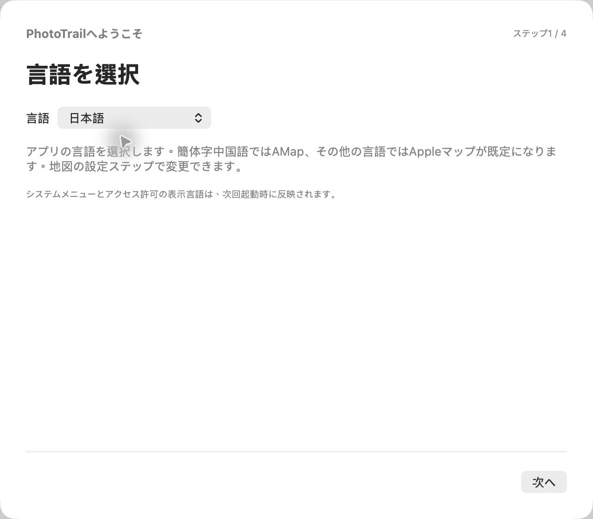

[简体中文](../../README.md) · [English](../../docs/i18n/README.en.md) · [繁體中文](../../docs/i18n/README.zh-Hant.md) · **日本語** · [한국어](../../docs/i18n/README.ko.md) · [Español](../../docs/i18n/README.es.md) · [Português do Brasil](../../docs/i18n/README.pt-BR.md)

# PhotoTrail

軌跡照合、メタデータ編集、一括リネームで、写真の撮影場所・情報・ファイル名を整理します。

PhotoTrail は macOS 向けの写真情報整理アプリです。旅の軌跡から位置を補い、日時や撮影情報を整え、規則に沿ってファイル名を変更できます。3 つの機能は個別にも利用でき、写真処理機能の一部は [GeoTag](https://github.com/marchyman/GeoTag) に由来します。

| 整理したいもの | 使う機能 | 使用例 |
| --- | --- | --- |
| 撮影場所 | 軌跡照合と地図 | 旅行の軌跡から位置を補完し、地図で確認 |
| 写真の情報 | メタデータの表示と編集 | 日時、作者、キーワード、機器情報を整理 |
| ファイル名 | 一括リネーム | 撮影日と連番、文字の置換、サイドカーとの連動 |

## 0.5.9 の新機能

設定でメタデータの文字サイズ、行間隔、完全なタグ名と検索履歴を管理でき、写真リストの並び順を記憶します。軌跡メニューから時刻や東西・南北の補正をプレビューして適用し、元ファイルを保持して GPX を別名で出力できます。リネームでは処理順の並べ替え、フィルター、ファイルグループのドラッグに対応し、結果の表示順は連番に影響しません。

## ダウンロードと必要環境

[最新の正式版をダウンロード](https://github.com/LittleSixNine/PhotoTrail/releases/latest) · [リリース履歴](https://github.com/LittleSixNine/PhotoTrail/releases)

**macOS 14以降**。Apple siliconとIntelに対応します。現在の配布版はad-hoc署名で、Developer ID署名とAppleの公証は未完了のため、初回起動時にmacOSがブロックする場合があります。

PhotoTrailは無料です。更新の自動ダウンロードは既定でオフ。インストールは手動です。DMGを開き、PhotoTrailを終了してから「アプリケーション」にドラッグしてください。

## 主な機能

### 1. 軌跡照合と地図での位置編集

- **時刻から位置を照合：** GPX・KML・KMZ を読み込み、各点の時刻と撮影日時を照合します。写真一覧で結果をプレビューし、地図の左側では位置の補完または明示的な置き換えができます。同じ軌跡区間と記録範囲内だけで照合し、断点をまたぐ外挿や競合の自動決定は行いません。
- **地図で確認・調整：** Apple マップと AMap、検索、お気に入り、写真サムネイルに対応。複数写真に同じ位置を設定したり、個別のマーカーをドラッグしたりできます。AMap の確定位置は検証後に WGS84 へ変換します。
- **写真から軌跡を作成：** 位置と撮影日時のある写真から GPX を作成し、長い時間差で区切ります。軌跡の表示・キャッシュ・書き出しや、位置付き写真コピーと確認レポートの新規フォルダへの出力もできます。

各点に時刻がない経路は表示のみです。軌跡 CSV は未対応で、写真からの軌跡出力は GPX です。KMZ はルートの doc.kml または唯一の KML を読み込み、外部リンクや添付リソースは読み込みません。

位置の保存時に州／県、市、地区と、検索サービスが返す国名・国コードも書き込めます。自動補完は設定で無効にでき、地図タブでは位置情報のあるローカル写真／XMP の不足項目を補えます。「写真」ライブラリは引き続きシステム API による位置と日時の更新のみ対応します。

### 2. メタデータの表示と編集

よく使う項目と全項目は同じ一覧・編集方式です。日時には EXIF、IPTC、XMP、ファイルシステムの出典を表示します。

- **項目の表示と編集：** 名前・タグ・値を検索し、グループで確認。文字、日時、機器に適した入力欄を使います。[機種一覧](../DEVICE_CATALOG.md)。
- **一括プリセット：** 設定、コピー、日時補正を順に組み、プレビュー後に未保存変更へ追加。作成、保存、読み込み、削除と JSON 入出力に対応し、1つの項目から複数項目へコピーできます。
- **項目のコピーと貼り付け：** ⌘C／⌘V または Ctrl+C／Ctrl+V で元の値を複数の編集可能項目へ貼り付けます。変更値はオレンジ表示で、ファイルへの反映には保存が必要です。
- **日時とデータ交換：** 年月日時分秒ごとに増減を選択。指定部分の変更、一定間隔の設定、範囲内の均等配分、対応する CSV／XMP 交換と写真ごとの比較ができます。

**表示可能な項目がすべて編集できるわけではありません。** JPEG と既存 XMP は出典・形式に応じて編集でき、ローカル JPEG の作成・更新日時も対象です。構造・計算・未検証のタグはロックされます。RAW 原本、HEIC、「写真」ライブラリは新規項目編集の対象外で、従来の日時・位置機能は維持します。[対象と制限](../BEHAVIOR.md)（中国語）。

### 3. 一括リネーム

- **ルールを順に並べる：** 三本線からカード全体をドラッグし、空白部分の右クリックで複製・削除。文字、日時、連番で置換・先頭に追加などの表現を統一しています。
- **命名設定の管理：** 5つの既定設定と個人設定を同じ一覧で編集、削除、保存、JSON 入出力できます。機器や都市は専用カードで指定でき、規則の変更後に先頭のプレビュー結果からファイル名の例を更新して設定と一緒に保存します。保存済みカードは折りたたんで読み込み、未保存規則は設定を上書きしません。
- **結果と競合の確認：** 一覧に元名・最終名・関連ファイル・競合を表示し、途中結果の列も選べます。数字接尾辞は2–5桁と区切り形式に対応し、実行時は中央の進捗と停止・復元を表示します。

3つの画面は写真と選択を共有し、リネーム画面からの読み込みも同じ一覧に入ります。初期範囲は全写真で、選択写真も指定できます。JPG／RAW／XMP の関連を維持し、一覧からの除外は同期・取り消し可能で、元ファイルは削除しません。ローカルパスのない写真は直接改名できません。日時・位置などの変更を先に保存し、プレビューを確認して改名を実行します。識別情報と内容が一致すれば記録から元名を復元できます。

### 変更の保存

既定の **「すべてのメタデータを書き込む」**（⌘S）は選択やフィルターに関係なく両タブの未保存変更を保存します。確認画面で実行、取り消し、現在のタブへの切り替え、以後の表示省略を選べます。写真と保存の設定で現在のタブのみを選ぶと、他のタブの変更は保持されます。閲覧やプレビューはファイルを書き換えません。ローカル保存はバックアップ設定に従い、再読み取りで確認し、画素は再圧縮しません。JPG＋RAW の位置は連動できますが、新しい項目は RAW に自動転記しません。「写真」はシステム API を使い、編集範囲が異なります。

## 大量の写真とキャッシュ

読み込みは全処理の残り時間を推定し、速度のサンプルが足りない場合は推定中と表示します。1回に300枚を超える場合は待機の案内を表示します。リネームは全体の進捗を表示し、停止して元名を復元できます。

読み込みとメタデータの準備が終わると、メタデータ一覧と位置情報のフィルムストリップでサムネイルを必要に応じて読み込み、現在の写真のプレビューを優先します。写真の切り替えやフィルムストリップのスクロールでは、同じ計算の繰り返しを減らしています。更新後も設定、お気に入り、軌跡キャッシュを引き継ぎます。サムネイルとメタデータ読み取りのキャッシュは実行中のみ保持し、再起動後に作り直します。

## 使い方

1. **読み込みと確認：** 言語・バックアップ・地図を設定し、写真を開くかドラッグします。撮影日時とカメラのタイムゾーンを確認し、必要に応じてメタデータ画面で補正します。
2. **位置を追加：** GPX／KML／KMZ を読み込み、写真を選んで照合結果を確認し、適切な結果を適用します。軌跡がなければ地図・検索・お気に入りを使います。
3. **写真情報を補完：** よく使う項目で素早く編集し、追加のタグや一括操作には全項目の表示へ切り替えます。
4. **まとめて保存：** 変更を確認して「すべてのメタデータを書き込む」を選択。AMap には自身の Web JS API Key と securityJsCode が必要です。Apple マップには AMap のキーは不要です。
5. **名前を整理：** 対象とルールを選び、ペアファイル、競合、新しい名前を確認して実行します。変更が不要なら省略できます。

各機能は個別にも利用できます。GPX 作成や位置付きコピーの出力は原本を上書きせず、一覧からの除外もファイルを削除しません。ローカルファイルのバックアップは「写真」ライブラリの項目を対象にしません。

## 言語と初期設定

簡体字中国語・英語・繁体字中国語・日本語・韓国語・スペイン語・ブラジルポルトガル語に対応。初期設定の最初に言語を選択します。**簡体字中国語はAMap、それ以外はAppleマップが既定**です。地図設定のステップで変更できます。既存ユーザーの地図設定は保持します。

後から「設定」で言語を変更できます。作業を保存してアプリを開き直すと、すべてのウインドウとシステムの通知に反映されます。言語を変更してもカメラのタイムゾーンや写真の日時は変わりません。

## 地図とプライバシー

AMapで選んだ位置は適用前にWGS84へ変換します。位置情報は保存操作を行ったときに写真へ書き込まれます。中国本土で撮影した写真の位置も正しく編集できます。

- 座標系が不明な既存写真は暫定的にWGS84として表示しますが、元のメタデータは書き換えません。
- AMapには検索語と地図表示・検証に必要な座標を送ります。写真ファイルは送りません。
- 有効なローカルキャッシュがない軌跡を表示すると、座標を分割してAMapへ送り変換します。軌跡ファイル自体は送信・変更せず、照合には元のWGS84データを使います。
- AMapキーはこのMacのキーチェーン、お気に入りと軌跡キャッシュはアプリのローカル領域に保存します。
- 地図の地名や検索結果は提供元に依存します。アプリの7言語対応は地図データの7言語対応を保証しません。
- 座標検証は座標系の混在による誤りを減らしますが、元のGPSや手動で選んだ地点の精度は保証しません。

AMapの開発者認証情報はご自身で取得してください。無料枠を超える利用や有料サービスはAMapから課金される場合があります。PhotoTrailは料金を徴収しません。支払いはAMapで管理してください。

## Agent Skillと開発

独立した[PhotoTrail Skillのガイド](SKILL.ja.md)も利用できます。Macアプリなしで、位置付き写真からGPXを作成したり、写真とGPXからJPEG/HEICの位置情報付きコピーとレポートを作成したりできます。**Python 3.11以降とExifTool**が必要で、macOSで検証済み。ローカルファイルへのアクセスとコマンド実行ができるagentが必要です。

Skillはローカル処理のみで、地図・アプリの認証情報・「写真」ライブラリを使いません。現在の書き込みはRAW/XMP非対応。コマンド名・JSONキー・状態値・エラーコードは言語で変わりません。

[開発ガイド（英語）](DEVELOPMENT.en.md)。GeoTagのMarco S Hyman氏とExifToolプロジェクトに感謝します。[ライセンス原文](../../LICENSE)、[英語の参考訳](LICENSE.en.md)、[第三者の権利表示](../../THIRD_PARTY_NOTICES.md)をご確認ください。個人・業務での利用と無料再配布が認められ、ソフトウェアの有料配布や有料アクセスには適用ライセンスに基づく許可が必要です。AppleおよびAMapの公式製品ではありません。
