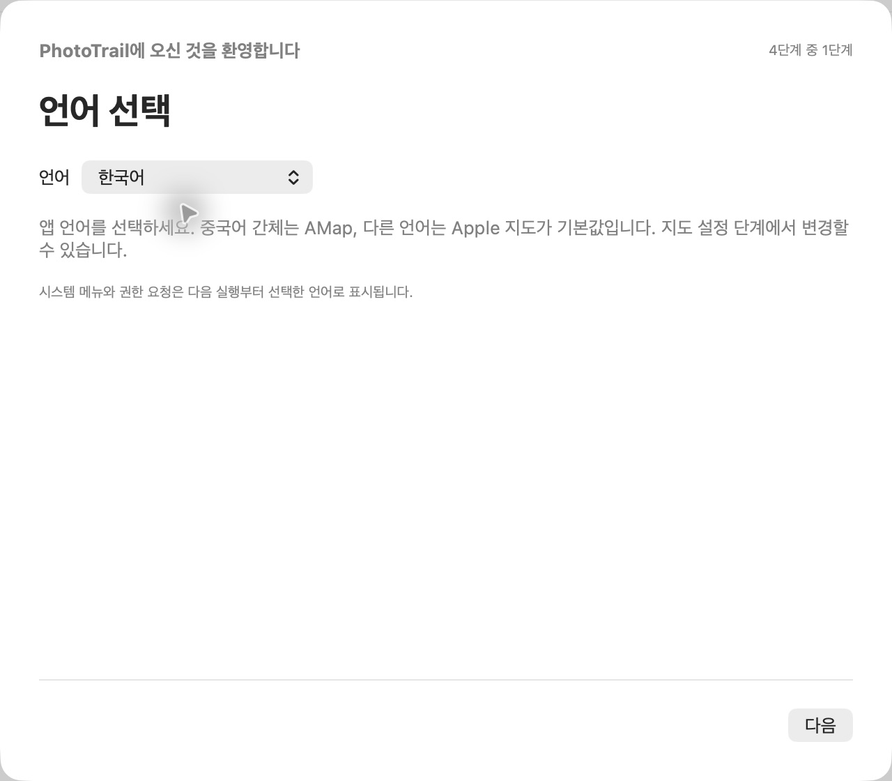

[简体中文](../../README.md) · [English](../../docs/i18n/README.en.md) · [繁體中文](../../docs/i18n/README.zh-Hant.md) · [日本語](../../docs/i18n/README.ja.md) · **한국어** · [Español](../../docs/i18n/README.es.md) · [Português do Brasil](../../docs/i18n/README.pt-BR.md)

# PhotoTrail

macOS에서 사진 촬영 위치를 추가하고 수정할 수 있습니다.

[GeoTag](https://github.com/marchyman/GeoTag)의 일부를 기반으로 개발했습니다. Apple 지도와 AMap, GPX 경로, 사진 썸네일 마커, 즐겨찾는 장소, 명시적인 메타데이터 저장을 지원합니다.

## 언어와 초기 설정

중국어 간체, 영어, 중국어 번체, 일본어, 한국어, 스페인어, 브라질 포르투갈어를 지원합니다. 초기 설정의 첫 단계에서 언어를 선택합니다. **중국어 간체는 AMap, 다른 언어는 Apple 지도가 기본값**입니다. 지도 설정 단계에서 직접 변경할 수 있습니다. 기존 사용자의 지도 설정은 유지합니다.

나중에 설정에서 언어를 변경할 수 있습니다. 작업을 저장하고 앱을 다시 열면 모든 창과 시스템 알림에 적용됩니다. 언어를 변경해도 카메라 시간대와 사진 촬영 시간은 바뀌지 않습니다.

## 주요 기능

- **지도 위치 편집:** Apple 지도나 AMap에서 촬영 장소를 선택합니다. AMap 좌표는 검증하고 WGS84로 변환한 뒤 적용합니다.
- **검색과 즐겨찾기:** 검색 결과를 미리 본 뒤 적용합니다. 장소에 이름과 메모를 붙이고 편집·삭제·재사용할 수 있습니다.
- **사진 목록과 지도:** 위치 유무와 저장 상태로 필터링하고 가져온 순서, 촬영 시간, 파일 이름으로 정렬합니다. 사진 막대에는 별도의 필터·정렬과 현재 사진으로 돌아가는 버튼이 있습니다.
- **일괄 편집과 실행 취소:** Command나 Shift로 여러 장을 선택하여 위치를 적용·복사·붙여넣기·지웁니다. 저장 전에는 실행 취소와 다시 실행이 가능합니다. 목록에서 제거해도 원본 파일은 삭제하지 않습니다.
- **GPX 일치:** 사진 목록에서 결과를 미리 보고 신뢰할 수 있는 결과를 적용합니다. 같은 경로 구간 안에서만 보간하며 충돌을 임의로 해결하지 않습니다. 경로 사이드바에서는 선택한 사진의 없는 위치를 채우거나 기존 위치를 바꿀 수 있습니다.
- **사진에서 GPX 생성:** 위치와 촬영 시간이 있는 사진으로 경로를 만듭니다. 카메라 시간대를 기준으로 UTC를 계산하고 긴 시간 간격은 새 구간으로 나눕니다. 로컬 저장과 내보내기를 지원합니다.
- **경로 기록:** 표시·숨기기, 범위 보기, 새로 고침과 변환 캐시 재사용을 지원합니다. 사진 일치는 항상 원본 WGS84 데이터를 사용합니다.
- **사진 마커:** 두 지도에서 로컬 썸네일을 표시합니다. 전체 또는 선택 사진만 표시하고 개별 선택·드래그와 화면 밖 사진 안내를 지원합니다.
- **화면과 저장 설정:** 라이트·다크·시스템 모드, AMap의 11가지 스타일, 시작 지도 화면, 백업과 저장 전 요약을 제공합니다.
- **JPG＋RAW:** 같은 이름의 파일 쌍을 함께 표시하고 저장 시 두 파일에 위치 변경을 적용합니다.
- **위치 정보 사본:** 원본 폴더 밖으로 내보내고 좌표를 다시 읽어 검증하며 원본 해시가 변하지 않았는지 확인합니다. 로컬 JSON 보고서도 생성합니다.
- **메타데이터:** 촬영 시간 등을 편집한 뒤 명시적으로 저장합니다. 로컬 파일에는 포함된 ExifTool을 사용하며 이미지 픽셀을 재압축하지 않습니다. 사진 보관함에는 시스템 Photos API를 사용합니다.

## 다운로드와 요구 사항

[GitHub Releases](https://github.com/LittleSixNine/PhotoTrail/releases)에서 공개된 패키지와 릴리스 정보를 확인하세요. 저장소에는 아직 배포되지 않은 변경 사항이 있을 수 있습니다. 언어 지원 여부는 릴리스 정보를 확인하세요.

**macOS 26 이상**이 필요하며 Apple silicon과 Intel을 지원합니다. 현재 배포는 ad-hoc 서명이며 Developer ID 서명과 Apple 공증은 완료되지 않아 처음 실행할 때 macOS가 차단할 수 있습니다.

PhotoTrail은 무료입니다. 자동 업데이트 다운로드는 기본적으로 꺼져 있습니다. 설치는 수동입니다. DMG를 열고 PhotoTrail을 종료한 다음 응용 프로그램 폴더로 드래그하세요.

## 사용 방법

1. 언어 → 사진 백업 → 지도 → 확인 순서로 설정합니다. 안내 화면의 언어는 즉시 바뀌지만 일부 시스템 표시는 앱을 다시 열어야 합니다.
2. 로컬 사진을 열거나 파일·폴더를 창으로 드래그하거나 사진 보관함에서 선택합니다. 이미지가 아닌 파일은 건너뛰며 GPX는 경로로 가져옵니다.
3. AMap에는 본인의 **웹용 JS API Key**와 **securityJsCode**가 필요합니다. 나중에 입력하거나 키가 필요 없는 Apple 지도를 사용할 수 있습니다.
4. 사진을 선택하고 지도, 검색 결과 또는 즐겨찾기에서 위치를 적용합니다. 이때는 저장 대기 상태이며 파일에 즉시 기록하지 않습니다.
5. 결과를 확인하고 저장합니다. 저장 전에는 실행 취소할 수 있습니다. 저장하지 않고 닫으려 하면 계속 편집하거나 변경 사항을 버릴지 확인합니다.

GPX 일치 전에 카메라 시간대를 확인하세요. 경로를 가져오고 사진을 선택하여 결과를 미리 본 후 적용합니다. 일치 기록은 현재 세션에만 유지됩니다. 경로를 가져오거나 표시하는 것만으로 사진 위치가 바뀌지는 않습니다.

GPX 생성과 위치 정보 사본 내보내기는 원본 사진을 덮어쓰지 않습니다. 로컬 파일 백업에는 사진 보관함 항목이 포함되지 않습니다. 보관함 업데이트와 파일 내보내기는 별도 작업입니다.

## 지도와 개인정보

AMap에서 선택한 위치는 적용 전에 WGS84로 변환합니다. 위치 변경은 저장할 때만 사진 파일에 기록됩니다. 중국 본토에서 촬영한 사진의 위치도 올바르게 수정할 수 있습니다.

- 좌표계가 명시되지 않은 기존 사진은 임시로 WGS84로 표시하지만 원본 메타데이터를 바꾸지 않습니다.
- AMap에는 검색어와 지도 표시·검증에 필요한 좌표를 전송합니다. 사진 파일은 업로드하지 않습니다.
- 유효한 로컬 캐시가 없는 경로를 표시하면 좌표를 나누어 AMap에 보내 변환합니다. GPX 파일 자체는 업로드하거나 수정하지 않으며 일치에는 원본 WGS84 데이터를 사용합니다.
- AMap 키는 이 Mac의 키체인에, 즐겨찾기와 경로 캐시는 앱의 로컬 데이터 폴더에 저장합니다.
- 지도 라벨, 검색 결과와 지명은 제공업체에 따라 다릅니다. 앱의 7개 언어 지원이 지도 데이터의 7개 언어 지원을 보장하지는 않습니다.
- 좌표 검증은 좌표계 혼용 오류를 줄이지만 원래 GPS 측정값이나 직접 고른 지점의 정확성을 보장하지 않습니다.

AMap 개발자 인증 정보는 직접 발급받아야 합니다. 무료 할당량 초과나 유료 서비스 이용 시 AMap이 계정에 요금을 청구할 수 있습니다. PhotoTrail은 요금을 징수하지 않습니다. 결제는 AMap에서 관리하세요.

## Agent Skill과 개발

독립적인 [PhotoTrail Skill 안내](SKILL.ko.md)도 제공합니다. Mac 앱 없이 위치가 있는 사진에서 GPX를 생성하거나 사진과 GPX에서 위치가 기록된 JPEG/HEIC 사본과 보고서를 만들 수 있습니다. **Python 3.11 이상과 ExifTool**이 필요하며 macOS에서 검증했습니다. 로컬 파일 접근과 명령 실행이 가능한 agent가 필요합니다.

Skill은 로컬에서 처리하며 지도, 앱 인증 정보, 사진 보관함을 사용하지 않습니다. 현재 쓰기 작업은 RAW/XMP를 지원하지 않습니다. 명령어, JSON 키, 상태값과 오류 코드는 언어에 따라 바뀌지 않습니다.

[개발 안내(영어)](DEVELOPMENT.en.md). GeoTag의 Marco S Hyman과 ExifTool 프로젝트에 감사드립니다. [라이선스 원문](../../LICENSE), [영어 참고 번역](LICENSE.en.md), [제3자 고지](../../THIRD_PARTY_NOTICES.md)를 확인하세요. 개인·업무용 사용과 무료 재배포는 허용되며 소프트웨어의 유료 배포나 유료 접근은 해당 라이선스에 따른 허가가 필요합니다. Apple 또는 AMap의 공식 제품이 아닙니다.
