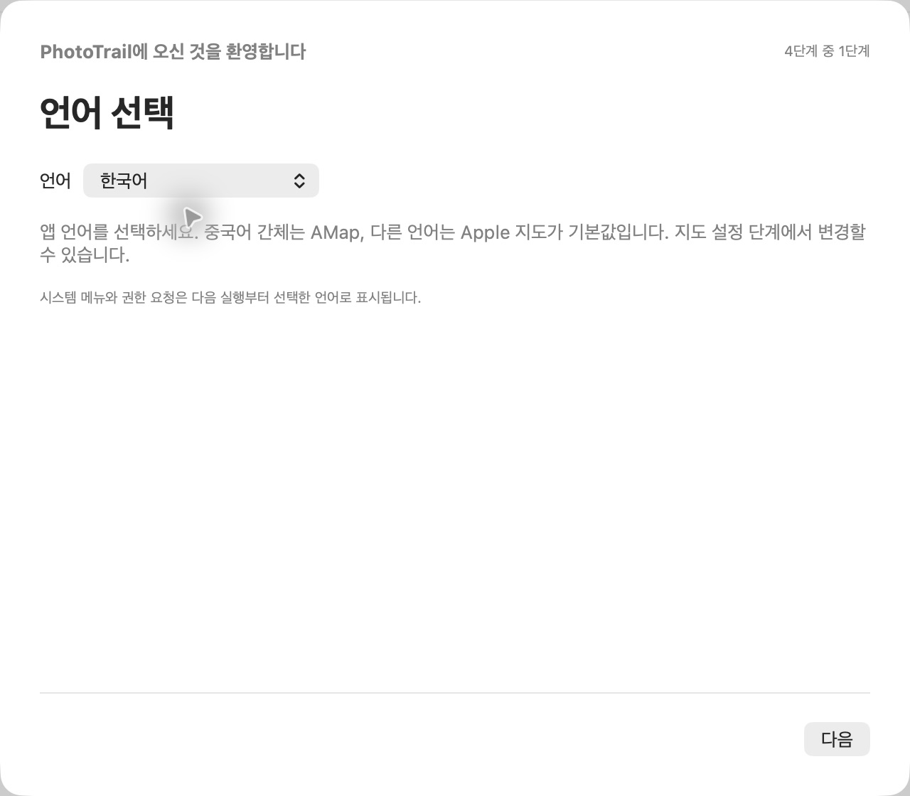

[简体中文](../../README.md) · [English](../../docs/i18n/README.en.md) · [繁體中文](../../docs/i18n/README.zh-Hant.md) · [日本語](../../docs/i18n/README.ja.md) · **한국어** · [Español](../../docs/i18n/README.es.md) · [Português do Brasil](../../docs/i18n/README.pt-BR.md)

# PhotoTrail

경로 매칭, 메타데이터 편집, 일괄 이름 변경으로 사진의 위치·정보·파일 이름을 정리합니다.

PhotoTrail은 macOS용 사진 정보 정리 앱입니다. 여행 경로로 위치를 채우고, 날짜와 촬영 정보를 수정한 다음, 규칙에 따라 파일 이름을 정리할 수 있습니다. 세 기능은 각각 독립적으로 사용할 수도 있습니다. 일부 사진 처리 기능은 [GeoTag](https://github.com/marchyman/GeoTag)를 기반으로 합니다.

| 정리할 내용 | 사용할 기능 | 사용 예 |
| --- | --- | --- |
| 촬영 위치 | 경로 매칭과 지도 | 여행 경로로 위치를 채우고 지도에서 확인 |
| 사진 정보 | 메타데이터 보기와 편집 | 날짜, 작성자, 키워드, 기기 정보 정리 |
| 파일 이름 | 일괄 이름 변경 | 촬영 날짜와 번호, 텍스트 바꾸기, 사이드카 연결 유지 |

## 다운로드와 요구 사항

[최신 정식 버전 다운로드](https://github.com/LittleSixNine/PhotoTrail/releases/latest) · [릴리스 기록](https://github.com/LittleSixNine/PhotoTrail/releases)

**macOS 26 이상**이 필요하며 Apple silicon과 Intel을 지원합니다. 현재 배포는 ad-hoc 서명이며 Developer ID 서명과 Apple 공증은 완료되지 않아 처음 실행할 때 macOS가 차단할 수 있습니다.

PhotoTrail은 무료입니다. 자동 업데이트 다운로드는 기본적으로 꺼져 있습니다. 설치는 수동입니다. DMG를 열고 PhotoTrail을 종료한 다음 응용 프로그램 폴더로 드래그하세요.

## 주요 기능

### 1. 경로 매칭과 지도 위치 편집

- **시간으로 위치 매칭:** GPX·KML·KMZ를 가져와 지점별 시간과 촬영 시간을 비교합니다. 사진 목록에서 결과를 미리 보거나 지도 왼쪽에서 누락된 위치를 채우고 기존 위치를 명시적으로 바꿀 수 있습니다. 같은 경로 구간과 기록 범위 안에서만 매칭하며, 끊어진 구간을 넘겨 추정하거나 충돌을 임의로 해결하지 않습니다.
- **지도에서 확인과 조정:** Apple 지도와 AMap, 검색, 즐겨찾기, 사진 썸네일을 지원합니다. 여러 사진에 같은 위치를 적용하거나 개별 마커를 끌 수 있습니다. AMap에서 확정한 위치는 검증 후 WGS84로 변환합니다.
- **사진에서 경로 만들기:** 위치와 촬영 시간이 있는 사진으로 GPX를 만들고 긴 시간 간격은 구간으로 나눕니다. 경로 표시·캐시·내보내기와 새 폴더로 위치 정보 사본 및 확인 보고서 내보내기를 지원합니다.

지점별 시간이 없는 경로는 보기만 가능합니다. 경로 CSV는 지원하지 않으며 사진으로 만든 경로는 GPX로 내보냅니다. KMZ는 루트의 doc.kml 또는 유일한 KML만 읽고 외부 링크나 첨부 리소스를 불러오지 않습니다.

### 2. 메타데이터 보기와 편집

- **자주 쓰는 필드 빠른 편집:** 사진 정보·날짜·기기를 그룹으로 표시합니다. 제목, 설명, 작성자, 권리, 키워드를 입력하고 상품명 또는 메타데이터 모델명을 선택하거나 직접 작성합니다. [기기 목록과 출처](../DEVICE_CATALOG.md).
- **전체 필드 확인:** 이름·값·출처를 간결하게 표시하며 검색·그룹·필터·추가 태그를 지원합니다. 선택한 사진부터 백그라운드에서 읽고 EXIF·IPTC·XMP·제조사 정보를 출처별로 보여 줍니다.
- **여러 사진과 필드 편집:** ⌘/Shift로 다중 선택하여 값을 통일하거나 다른 필드에서 복사합니다. 각 사진의 EXIF 생성 시간을 여러 날짜 필드에 복사하는 작업도 미리 본 뒤 실행 취소 가능한 초안으로 추가합니다.
- **정보 정리와 교환:** 날짜 보정, 카메라·렌즈·노출 정보, 프리셋, 사진별 비교, 지원되는 메타데이터의 CSV/XMP 가져오기와 내보내기를 제공합니다.

**읽을 수 있는 모든 태그를 편집할 수 있는 것은 아닙니다.** 새 편집기는 JPEG와 기존 XMP 사이드카의 62개 필드를 지원하며 읽기 전용에는 잠금 표시가 있습니다. RAW 원본·HEIC·사진 보관함은 새 필드 편집 대상이 아니지만 기존 날짜·위치 기능은 유지됩니다. 메타데이터 CSV는 지원하지 않는 경로 CSV와 별개입니다. [대상과 제한](../BEHAVIOR.md)(중국어).

### 3. 일괄 이름 변경

- **자주 쓰는 방식으로 시작:** 촬영 날짜＋번호, 접두사, 찾기 및 바꾸기를 선택합니다. 텍스트·날짜·번호·메타데이터·목록·정규식 등 97개 작업 항목과 필터 및 고급 설정을 조합할 수 있습니다.
- **변경 전후 비교:** 왼쪽에서 규칙을 정렬하고 오른쪽에서 원래 이름, 최종 이름, 연결 파일, 충돌을 확인합니다. 중간 결과를 표시하거나 프리셋으로 저장할 수 있습니다.
- **연결 파일 유지:** 사진과 사이드카를 함께 미리 보며 기존 파일을 덮어쓰지 않습니다. 파일 식별 정보와 내용이 기록과 같으면 실행 기록에서 원래 이름을 복원할 수 있습니다.

가져온 로컬 사진이나 파일 추가로 지정한 일반 파일을 사용합니다. 폴더와 사진 보관함 항목은 제외됩니다. 저장하지 않은 사진 정보나 위치가 있으면 먼저 저장하도록 안내하며, 갱신된 미리보기를 확인한 후 이름을 변경합니다. 메타데이터 저장과는 별도 작업입니다.

### 변경 사항 저장

**모든 메타데이터 저장**(⌘S)은 현재 창에 있는 사진 정보와 위치의 모든 미저장 변경 사항을 기록합니다. 현재 탭·선택·필터에 범위를 한정하지 않습니다. 보기나 미리보기만으로 파일을 쓰지 않으며 저장 전에 실행 취소할 수 있습니다. 로컬 쓰기는 백업 설정을 따르고 다시 읽어 결과를 확인하며 이미지 픽셀을 재압축하지 않습니다. JPG＋RAW는 위치 변경을 함께 저장할 수 있지만 새 필드는 RAW에 자동 복사하지 않습니다. 사진 보관함은 시스템 API를 사용하며 편집 범위가 다릅니다.

## 사용 방법

1. **가져오기와 확인:** 언어·백업·지도를 설정하고 사진을 열거나 끌어 넣습니다. 촬영 시간과 카메라 시간대를 확인하고 필요한 날짜 수정은 메타데이터 화면에서 합니다.
2. **위치 추가:** GPX/KML/KMZ를 가져오고 사진을 선택하여 결과를 확인한 후 올바른 매칭을 적용합니다. 경로가 없으면 지도·검색·즐겨찾기를 사용합니다.
3. **사진 정보 채우기:** 자주 쓰는 필드에서 빠르게 편집하고 추가 태그나 일괄 도구가 필요하면 전체 필드로 전환합니다.
4. **함께 저장:** 변경 사항을 검토한 후 모든 메타데이터 저장을 누릅니다. AMap에는 자신의 Web JS API Key와 securityJsCode가 필요합니다. Apple 지도에는 AMap 키가 필요하지 않습니다.
5. **이름 정리:** 범위와 규칙을 선택하고 연결 파일·충돌·최종 이름을 확인한 뒤 실행합니다. 이름을 유지하려면 건너뜁니다.

각 기능을 독립적으로 사용할 수 있습니다. GPX 생성이나 위치 정보 사본 내보내기는 원본을 덮어쓰지 않으며 목록에서 제거해도 파일은 삭제되지 않습니다. 로컬 파일 백업에는 사진 보관함 항목이 포함되지 않습니다.

## 언어와 초기 설정

중국어 간체, 영어, 중국어 번체, 일본어, 한국어, 스페인어, 브라질 포르투갈어를 지원합니다. 초기 설정의 첫 단계에서 언어를 선택합니다. **중국어 간체는 AMap, 다른 언어는 Apple 지도가 기본값**입니다. 지도 설정 단계에서 직접 변경할 수 있습니다. 기존 사용자의 지도 설정은 유지합니다.

나중에 설정에서 언어를 변경할 수 있습니다. 작업을 저장하고 앱을 다시 열면 모든 창과 시스템 알림에 적용됩니다. 언어를 변경해도 카메라 시간대와 사진 촬영 시간은 바뀌지 않습니다.

## 지도와 개인정보

AMap에서 선택한 위치는 적용 전에 WGS84로 변환합니다. 위치 변경은 저장할 때만 사진 파일에 기록됩니다. 중국 본토에서 촬영한 사진의 위치도 올바르게 수정할 수 있습니다.

- 좌표계가 명시되지 않은 기존 사진은 임시로 WGS84로 표시하지만 원본 메타데이터를 바꾸지 않습니다.
- AMap에는 검색어와 지도 표시·검증에 필요한 좌표를 전송합니다. 사진 파일은 업로드하지 않습니다.
- 유효한 로컬 캐시가 없는 경로를 표시하면 좌표를 나누어 AMap에 보내 변환합니다. 경로 파일 자체는 업로드하거나 수정하지 않으며 일치에는 원본 WGS84 데이터를 사용합니다.
- AMap 키는 이 Mac의 키체인에, 즐겨찾기와 경로 캐시는 앱의 로컬 데이터 폴더에 저장합니다.
- 지도 라벨, 검색 결과와 지명은 제공업체에 따라 다릅니다. 앱의 7개 언어 지원이 지도 데이터의 7개 언어 지원을 보장하지는 않습니다.
- 좌표 검증은 좌표계 혼용 오류를 줄이지만 원래 GPS 측정값이나 직접 고른 지점의 정확성을 보장하지 않습니다.

AMap 개발자 인증 정보는 직접 발급받아야 합니다. 무료 할당량 초과나 유료 서비스 이용 시 AMap이 계정에 요금을 청구할 수 있습니다. PhotoTrail은 요금을 징수하지 않습니다. 결제는 AMap에서 관리하세요.

## Agent Skill과 개발

독립적인 [PhotoTrail Skill 안내](SKILL.ko.md)도 제공합니다. Mac 앱 없이 위치가 있는 사진에서 GPX를 생성하거나 사진과 GPX에서 위치가 기록된 JPEG/HEIC 사본과 보고서를 만들 수 있습니다. **Python 3.11 이상과 ExifTool**이 필요하며 macOS에서 검증했습니다. 로컬 파일 접근과 명령 실행이 가능한 agent가 필요합니다.

Skill은 로컬에서 처리하며 지도, 앱 인증 정보, 사진 보관함을 사용하지 않습니다. 현재 쓰기 작업은 RAW/XMP를 지원하지 않습니다. 명령어, JSON 키, 상태값과 오류 코드는 언어에 따라 바뀌지 않습니다.

[개발 안내(영어)](DEVELOPMENT.en.md). GeoTag의 Marco S Hyman과 ExifTool 프로젝트에 감사드립니다. [라이선스 원문](../../LICENSE), [영어 참고 번역](LICENSE.en.md), [제3자 고지](../../THIRD_PARTY_NOTICES.md)를 확인하세요. 개인·업무용 사용과 무료 재배포는 허용되며 소프트웨어의 유료 배포나 유료 접근은 해당 라이선스에 따른 허가가 필요합니다. Apple 또는 AMap의 공식 제품이 아닙니다.
