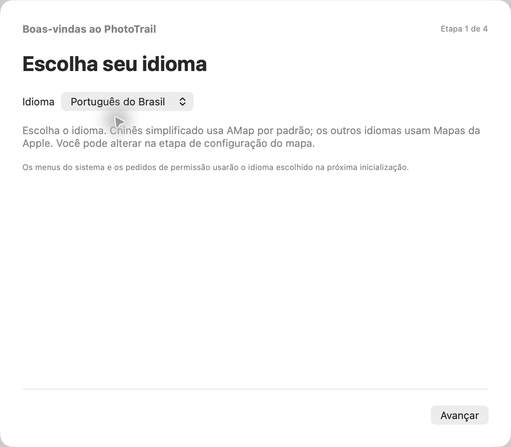

[简体中文](../../README.md) · [English](../../docs/i18n/README.en.md) · [繁體中文](../../docs/i18n/README.zh-Hant.md) · [日本語](../../docs/i18n/README.ja.md) · [한국어](../../docs/i18n/README.ko.md) · [Español](../../docs/i18n/README.es.md) · **Português do Brasil**

# PhotoTrail

Adicione e edite locais de captura das fotos no macOS.

O PhotoTrail é um app para macOS baseado em parte no [GeoTag](https://github.com/marchyman/GeoTag). Combina Mapas da Apple, AMap, trilhas GPX, marcadores com miniaturas, locais favoritos e controle explícito sobre o salvamento de metadados.

## Idiomas e configuração

Disponível em chinês simplificado, inglês, chinês tradicional, japonês, coreano, espanhol e português do Brasil. Escolha o idioma na primeira etapa da configuração. **Chinês simplificado usa AMap por padrão; os demais idiomas usam Mapas da Apple.** Você pode alterar isso na etapa do mapa. O mapa escolhido por usuários existentes é preservado.

É possível alterar o idioma nos Ajustes. Salve seu trabalho e reabra o app para aplicá-lo a todas as janelas e avisos do sistema. O idioma não altera o fuso horário da câmera nem as datas das fotos.

## Recursos

- **Localização pelo mapa:** escolha um ponto no Mapas da Apple ou AMap. As coordenadas do AMap são verificadas e convertidas para WGS84 antes de serem aplicadas.
- **Busca e favoritos:** visualize os resultados antes de aplicá-los. Salve locais com nomes e notas; edite, exclua ou reutilize.
- **Lista e espaço de mapas:** filtre por localização ou alterações pendentes e ordene por importação, data de captura ou nome. A faixa de fotos tem filtros e ordenação próprios e um botão para voltar à foto atual.
- **Edição em lote e desfazer:** selecione com Command ou Shift para aplicar, copiar, colar ou limpar localizações. Você pode desfazer e refazer antes de salvar. Remover fotos da lista não exclui os arquivos.
- **Correspondência GPX cuidadosa:** visualize os resultados na lista e aplique os confiáveis. A interpolação fica dentro de um segmento e sua cobertura de tempo; conflitos entre trilhas não são resolvidos silenciosamente. A barra de trilhas permite preencher localizações ausentes ou substituir as da seleção.
- **GPX a partir de fotos:** crie trilhas usando localizações e datas de captura. O fuso da câmera determina a saída UTC; intervalos longos criam segmentos separados. As trilhas ficam salvas localmente e podem ser exportadas.
- **Histórico de trilhas:** mostre ou oculte trilhas, veja sua extensão, atualize e reutilize o cache local de conversões. As correspondências sempre usam o WGS84 original.
- **Marcadores de fotos:** os dois mapas mostram miniaturas locais. Exiba todas as fotos ou apenas a seleção, selecione e arraste marcadores e encontre fotos selecionadas fora da área visível.
- **Aparência e ajustes:** modo claro, escuro ou do sistema; onze estilos do AMap; visualização inicial; backups e resumo opcional antes de salvar.
- **Pares JPG + RAW:** são exibidos juntos e ambos recebem as alterações de localização ao salvar.
- **Cópias com localização:** exporte fora da pasta original, verifique as coordenadas gravadas e confira se os hashes dos originais permanecem iguais. Gera um relatório JSON local.
- **Metadados:** edite a data de captura e outros campos compatíveis com salvamento explícito. Arquivos locais usam o ExifTool incluído, sem recomprimir os pixels. A fototeca usa a interface Photos do sistema.

## Download e requisitos

Veja os pacotes publicados e suas notas no [GitHub Releases](https://github.com/LittleSixNine/PhotoTrail/releases). O repositório pode conter mudanças ainda não publicadas; confira os idiomas disponíveis nas notas de cada versão.

Requer **macOS 26 ou posterior**. Compatível com Apple silicon e Intel. A distribuição atual usa assinatura ad-hoc e ainda não tem assinatura Developer ID nem notarização da Apple; por isso, o macOS pode bloquear a primeira abertura.

O PhotoTrail é gratuito. O download automático de atualizações fica desativado por padrão. A instalação é manual: abra o DMG, saia do PhotoTrail e arraste o app para Aplicativos.

## Primeiros passos

1. Configure idioma, backup das fotos, mapa e confirmação. O idioma do guia muda imediatamente; alguns avisos do sistema exigem reabrir o app.
2. Abra fotos locais, arraste arquivos ou pastas para a janela ou selecione fotos da fototeca. Arquivos que não são imagens são ignorados; GPX são importados como trilhas.
3. Para o AMap, insira sua **Key da API JS para web** e **securityJsCode**. Você pode fazer isso depois ou usar Mapas da Apple sem chaves do AMap.
4. Selecione fotos e aplique um ponto do mapa, resultado de busca ou favorito. Isso cria alterações pendentes; não grava imediatamente no arquivo.
5. Confira e salve. Você pode desfazer antes de salvar. Ao fechar com alterações pendentes, o app pede para continuar editando ou descartá-las.

Para comparar com GPX, confira primeiro o fuso da câmera, importe a trilha, selecione fotos e visualize os resultados. O histórico de correspondências dura apenas a sessão atual. Importar ou mostrar uma trilha não altera as localizações das fotos.

Criar GPX ou exportar cópias não sobrescreve as fotos originais. Backups de arquivos locais não incluem itens da fototeca. Atualizar a fototeca e exportar arquivos são operações distintas.

## Mapas e privacidade

O AMap converte para WGS84 os locais escolhidos antes de aplicá-los. As alterações só são gravadas nas fotos quando você salva. Também é possível editar corretamente a localização de fotos tiradas na China continental.

- Coordenadas existentes sem datum declarado são exibidas provisoriamente como WGS84; isso não reescreve os metadados.
- O AMap recebe termos de busca e coordenadas necessárias para exibir o mapa e validar locais. Arquivos de fotos não são enviados.
- Exibir uma trilha sem cache local válido envia suas coordenadas em lotes ao AMap para conversão. O arquivo GPX não é enviado nem modificado, e as correspondências continuam usando os dados WGS84 originais.
- As chaves ficam nas Chaves do macOS; favoritos e caches de trilhas, na pasta local do app.
- Rótulos, resultados e nomes de lugares dependem do provedor. Sete idiomas de interface não garantem mapas em sete idiomas.
- A validação reduz erros por misturar sistemas de coordenadas, mas não confirma a precisão do GPS original nem de um ponto escolhido manualmente.

Obtenha suas próprias credenciais do AMap. Exceder a cota gratuita ou usar serviços pagos pode gerar cobranças na sua conta. O PhotoTrail não cobra essas tarifas; gerencie os pagamentos na plataforma do AMap.

## Skill para agentes e desenvolvimento

O [guia do Skill independente](SKILL.pt-BR.md) explica como criar GPX a partir de fotos ou gerar cópias JPEG/HEIC com localização e relatórios usando fotos e GPX. Requer **Python 3.11+ e ExifTool** e foi verificado no macOS. O agente precisa acessar arquivos locais e executar comandos; um chat apenas com navegador não basta.

O Skill processa localmente e não acessa mapas, credenciais do app ou fototeca. A gravação atual não aceita RAW/XMP. Comandos, chaves JSON, estados e códigos de erro não mudam com o idioma.

Consulte o [guia de desenvolvimento em inglês](DEVELOPMENT.en.md). Agradecimentos a Marco S Hyman pelo GeoTag e ao projeto ExifTool. Consulte a [licença original](../../LICENSE), a [tradução de referência em inglês](LICENSE.en.md) e os [avisos de terceiros](../../THIRD_PARTY_NOTICES.md). O uso pessoal e profissional e a redistribuição gratuita são permitidos; cobrar pela distribuição do software ou pelo acesso exige permissão conforme a licença aplicável. O PhotoTrail é independente e não tem afiliação oficial com Apple ou AMap.
