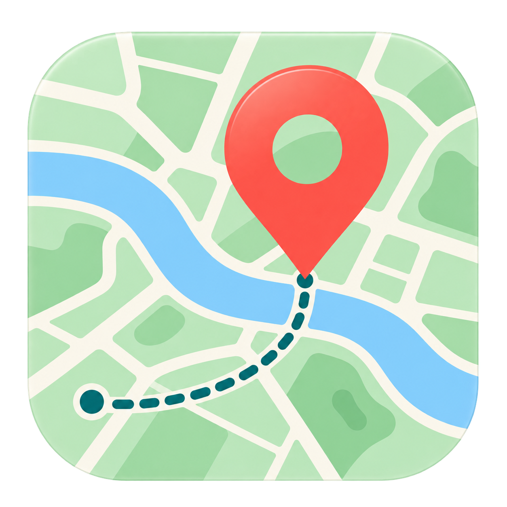
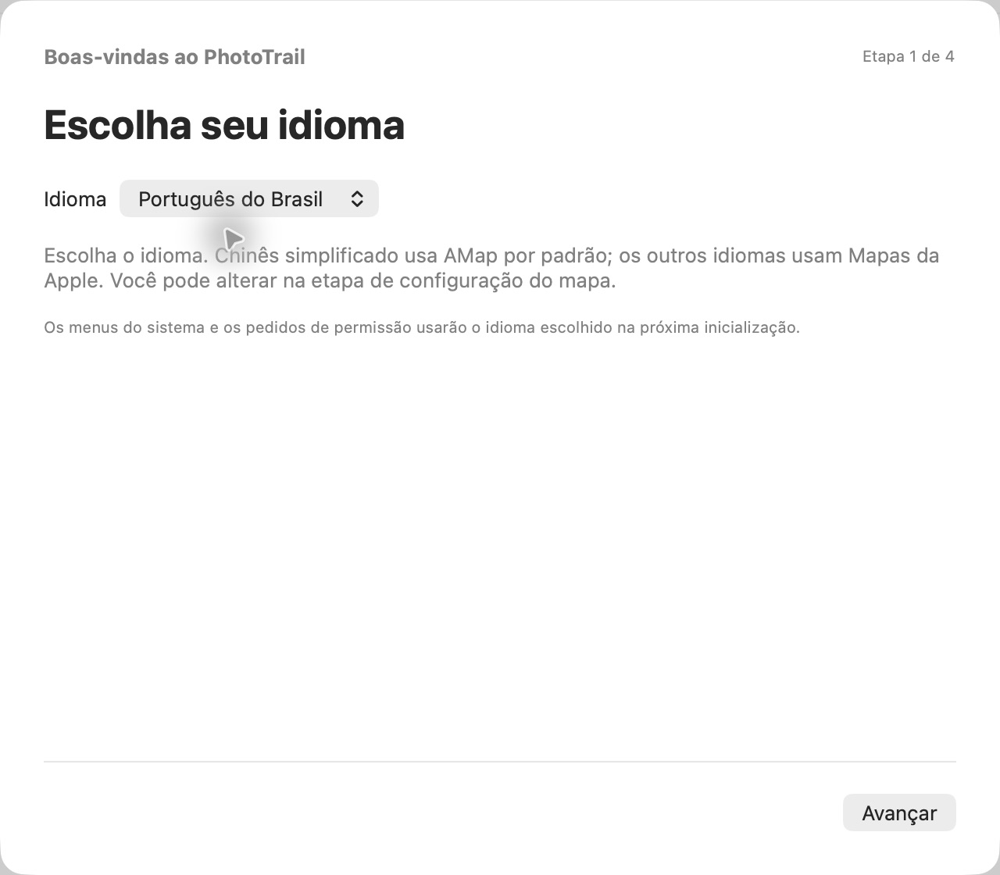

[简体中文](../../README.md) · [English](../../docs/i18n/README.en.md) · [繁體中文](../../docs/i18n/README.zh-Hant.md) · [日本語](../../docs/i18n/README.ja.md) · [한국어](../../docs/i18n/README.ko.md) · [Español](../../docs/i18n/README.es.md) · **Português do Brasil**

# PhotoTrail

Organize localizações, metadados e nomes de fotos no macOS.

O PhotoTrail reúne **correspondência com trajetos, edição de metadados e renomeação em lote**. Complete os locais de uma viagem, corrija datas e informações e aplique um padrão aos nomes. Use os três fluxos em conjunto ou separadamente. Parte do processamento de fotos vem do [GeoTag](https://github.com/marchyman/GeoTag).

| O que organizar | Recurso | Exemplos |
| --- | --- | --- |
| Locais de captura | Trajetos e mapas | Associar um trajeto e conferir posições no mapa |
| Informações das fotos | Consulta e edição de metadados | Datas, autoria, palavras-chave e equipamento |
| Nomes dos arquivos | Renomeação em lote | Data e sequência, substituição de texto e arquivos associados |

## Download e requisitos

[Baixar a versão estável mais recente](https://github.com/LittleSixNine/PhotoTrail/releases/latest) · [Histórico de versões](https://github.com/LittleSixNine/PhotoTrail/releases)

Requer **macOS 26 ou posterior**. Compatível com Apple silicon e Intel. A distribuição atual usa assinatura ad-hoc e ainda não tem assinatura Developer ID nem notarização da Apple; por isso, o macOS pode bloquear a primeira abertura.

O PhotoTrail é gratuito. O download automático de atualizações fica desativado por padrão. A instalação é manual: abra o DMG, saia do PhotoTrail e arraste o app para Aplicativos.

## Recursos

### 1. Trajetos e localização no mapa

- **Encontre posições pelo horário:** importe GPX, KML ou KMZ com horário em cada ponto. Confira as correspondências na lista ou use a barra do mapa para completar locais ausentes ou substituí-los explicitamente. A correspondência fica dentro do mesmo segmento e da cobertura registrada; não extrapola interrupções nem resolve conflitos sem avisar.
- **Confira e ajuste no mapa:** use Mapas da Apple ou AMap, busca, favoritos e miniaturas. Aplique um local a várias fotos ou arraste um marcador individual. As posições confirmadas no AMap são verificadas e convertidas para WGS84.
- **Crie e exporte trajetos:** gere GPX com fotos que tenham localização e data; intervalos longos criam segmentos. Exiba, oculte, armazene em cache e exporte trajetos, ou exporte cópias com localização e um relatório de verificação para uma nova pasta.

Trajetos sem horário por ponto servem apenas para visualização. CSV de trajetos não é aceito; trajetos gerados de fotos são exportados como GPX. KMZ lê doc.kml na raiz ou o único KML do arquivo, sem carregar links externos ou anexos.

### 2. Consulta e edição de metadados

Os campos comuns e completos usam a mesma lista e os mesmos controles. Datas indicam a origem EXIF, IPTC, XMP ou do sistema de arquivos.

- **Consulte e edite campos:** pesquise nomes, tags ou valores e navegue por grupos. Texto, datas e dispositivos usam editores adequados. [Catálogo](../DEVICE_CATALOG.md).
- **Predefinições em lote:** organize atribuições, cópias e ajustes de datas; confira a prévia antes de adicionar alterações pendentes. Crie, salve, carregue, exclua e troque arquivos JSON; copie um campo para vários destinos.
- **Copie e cole campos:** ⌘C/⌘V ou Ctrl+C/Ctrl+V colam o valor original em vários campos editáveis. Valores alterados aparecem em laranja; ainda é preciso salvar para gravar os arquivos.
- **Datas e troca de dados:** aumente ou diminua anos, meses, dias, horas, minutos e segundos separadamente. Altere uma parte da data, use intervalos fixos ou distribua datas igualmente; mantenha a troca controlada CSV/XMP e a comparação por foto.

**Nem todo campo legível pode ser editado.** Os campos aceitos em JPEG e XMP existentes dependem da origem e formato. Datas de criação e modificação de JPEG locais também são editáveis. Tags estruturais, calculadas ou não verificadas continuam bloqueadas. RAW originais, HEIC e Fotos da Apple não usam estes novos editores; as ferramentas anteriores de data e localização permanecem. [Destinos e limites](../BEHAVIOR.md) (chinês).

### 3. Renomeação em lote

- **Ordene regras:** arraste a alça de três linhas para mover o cartão; clique com o botão direito no espaço vazio para duplicar ou excluir. Texto, datas e sequências usam termos consistentes como Substituir e Adicionar no início.
- **Gerencie predefinições:** o painel esquerdo mostra a atual. Alterne entre opções comuns ou pessoais, pesquise, atualize, salve uma cópia, renomeie, exclua e troque JSON. Ao iniciar, a última predefinição é restaurada sem ser sobrescrita por regras não salvas.
- **Confira nomes e conflitos:** a tabela mostra nomes originais e finais, arquivos relacionados e conflitos, com uma coluna intermediária opcional. Sufixos numéricos oferecem 2–5 dígitos e separadores. A execução mostra progresso central e Parar e restaurar.

As três abas compartilham fotos e seleção, inclusive importações pela aba Renomear. O padrão é processar todas as fotos, com opção para as selecionadas. As associações JPG/RAW/XMP são mantidas. Remover uma foto sincroniza as abas, pode ser desfeito e não exclui o arquivo. Fotos sem caminho local não podem ser renomeadas diretamente. Salve alterações de informações ou localização, confira a prévia e confirme a renomeação. Os registros restauram nomes apenas quando identidade e conteúdo coincidem.

### Salvar alterações

**Salvar todos os metadados** (⌘S) grava todas as alterações pendentes de informações e localização da janela atual, sem limitar o alcance à aba, seleção ou filtro ativos. Consultar e visualizar não grava arquivos; é possível desfazer antes de salvar. A gravação local segue as configurações de backup e verifica os resultados por releitura, sem recomprimir os pixels. Pares JPG + RAW podem compartilhar alterações de localização, mas os novos campos não são copiados automaticamente para RAW. A fototeca usa a interface do sistema e tem outro escopo de edição.

## Muitas fotos e cache

A importação estima o tempo restante de todo o processo; sem dados de velocidade suficientes, indica que a estimativa está sendo calculada. Lotes com mais de 300 fotos mostram um aviso de espera. A renomeação mostra o progresso geral e permite parar e restaurar os nomes.

Após importar as fotos e preparar os metadados, as miniaturas são carregadas sob demanda na lista de metadados e na faixa de fotos da página de localização, com prioridade para a prévia da foto atual. A troca de fotos e a rolagem da faixa evitam cálculos repetidos. As atualizações preservam configurações, favoritos e caches de trajetos; os caches de miniaturas e leitura de metadados duram apenas durante a sessão e são recriados ao reabrir o app.

## Primeiros passos

1. **Importe e confira:** configure idioma, backups e mapa, depois abra ou arraste fotos. Confira datas e fuso da câmera; corrija-os no espaço de metadados quando necessário.
2. **Adicione locais:** importe GPX/KML/KMZ, selecione fotos, confira as correspondências e aplique os resultados confiáveis. Sem trajeto, use mapa, busca ou favoritos.
3. **Complete as informações:** use campos comuns para editar rapidamente e a lista completa para outras tags e ferramentas em lote.
4. **Salve tudo junto:** confira as alterações e clique em Salvar todos os metadados. O AMap exige sua Web JS API Key e securityJsCode; Mapas da Apple não precisa de credenciais do AMap.
5. **Organize os nomes:** escolha o alcance e as regras, confira arquivos associados, conflitos e nomes finais e confirme. Pule esta etapa se quiser manter os nomes.

Cada recurso pode ser usado separadamente. Gerar GPX ou exportar cópias com localização não sobrescreve os originais; remover fotos da lista não exclui os arquivos. Backups de arquivos locais não incluem itens da fototeca.

## Idiomas e configuração

Disponível em chinês simplificado, inglês, chinês tradicional, japonês, coreano, espanhol e português do Brasil. Escolha o idioma na primeira etapa da configuração. **Chinês simplificado usa AMap por padrão; os demais idiomas usam Mapas da Apple.** Você pode alterar isso na etapa do mapa. O mapa escolhido por usuários existentes é preservado.

É possível alterar o idioma nos Ajustes. Salve seu trabalho e reabra o app para aplicá-lo a todas as janelas e avisos do sistema. O idioma não altera o fuso horário da câmera nem as datas das fotos.

## Mapas e privacidade

O AMap converte para WGS84 os locais escolhidos antes de aplicá-los. As alterações só são gravadas nas fotos quando você salva. Também é possível editar corretamente a localização de fotos tiradas na China continental.

- Coordenadas existentes sem datum declarado são exibidas provisoriamente como WGS84; isso não reescreve os metadados.
- O AMap recebe termos de busca e coordenadas necessárias para exibir o mapa e validar locais. Arquivos de fotos não são enviados.
- Exibir uma trilha sem cache local válido envia suas coordenadas em lotes ao AMap para conversão. O arquivo do trajeto não é enviado nem modificado, e as correspondências continuam usando os dados WGS84 originais.
- As chaves ficam nas Chaves do macOS; favoritos e caches de trilhas, na pasta local do app.
- Rótulos, resultados e nomes de lugares dependem do provedor. Sete idiomas de interface não garantem mapas em sete idiomas.
- A validação reduz erros por misturar sistemas de coordenadas, mas não confirma a precisão do GPS original nem de um ponto escolhido manualmente.

Obtenha suas próprias credenciais do AMap. Exceder a cota gratuita ou usar serviços pagos pode gerar cobranças na sua conta. O PhotoTrail não cobra essas tarifas; gerencie os pagamentos na plataforma do AMap.

## Skill para agentes e desenvolvimento

O [guia do Skill independente](SKILL.pt-BR.md) explica como criar GPX a partir de fotos ou gerar cópias JPEG/HEIC com localização e relatórios usando fotos e GPX. Requer **Python 3.11+ e ExifTool** e foi verificado no macOS. O agente precisa acessar arquivos locais e executar comandos; um chat apenas com navegador não basta.

O Skill processa localmente e não acessa mapas, credenciais do app ou fototeca. A gravação atual não aceita RAW/XMP. Comandos, chaves JSON, estados e códigos de erro não mudam com o idioma.

Consulte o [guia de desenvolvimento em inglês](DEVELOPMENT.en.md). Agradecimentos a Marco S Hyman pelo GeoTag e ao projeto ExifTool. Consulte a [licença original](../../LICENSE), a [tradução de referência em inglês](LICENSE.en.md) e os [avisos de terceiros](../../THIRD_PARTY_NOTICES.md). O uso pessoal e profissional e a redistribuição gratuita são permitidos; cobrar pela distribuição do software ou pelo acesso exige permissão conforme a licença aplicável. O PhotoTrail é independente e não tem afiliação oficial com Apple ou AMap.
